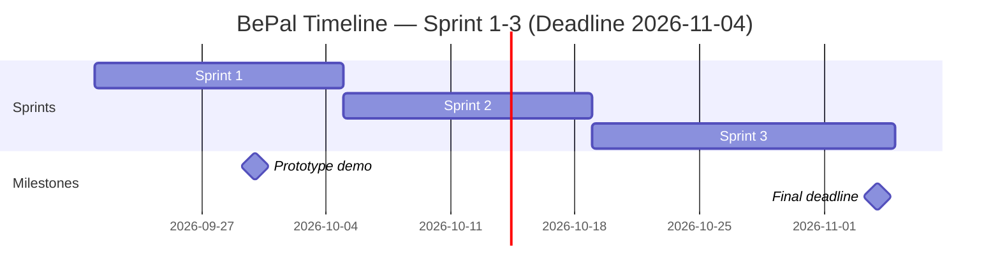

# Sprint Backlog — BePal

**Version:** 4.0 | **Last Updated:** 2026-09-28

> ภาพรวมว่า User Story ไหนจาก [[01-product-backlog|Product Backlog]] จะไปอยู่ Sprint ไหน — Sprint ที่ยังไม่ถึงคือ draft คร่าวๆ ปรับได้เสมอเมื่อเข้าใจงานมากขึ้น
> คนรับผิดชอบและ Status อยู่ใน `sprint-plan-[NN].md` ของ Sprint ที่กำลังทำ

## Timeline (3 Sprint, สิ้นสุด 4 พ.ย. 2026)

| Sprint | เริ่ม | สิ้นสุด | เป้าหมาย |
|---|---|---|---|
| Sprint 1 | 2026-09-21 | 2026-10-04 | Prototype เล่นได้ Day 1–5 (ส่ง **พุธ 30 ก.ย.**) |
| Sprint 2 | 2026-10-05 | 2026-10-18 | ใส่ Art / Audio จริง + Balance + Passive |
| Sprint 3 | 2026-10-19 | 2026-11-04 | Polish + Could Have + เตรียมส่งงาน |

> วันเริ่ม Sprint 1 ตั้งจากวันที่ GDD v2 เริ่ม (20 ก.ย.) — ปรับให้ตรงกับวันที่ทีมเริ่มลงมือจริงได้

## Sprint 1 (กำลังทำ) — 61 SP

| # | User Story | MoSCoW | Estimate (SP) |
|---|---|---|---|
| M1 | As a player, I want to choose 1 of 3 starter pets | Must Have | 3 |
| M2 | As a player, I want to walk around the sanctuary with A/D and interact with Space | Must Have | 5 |
| M3 | As a player, I want to pick a care action from a spinning wheel | Must Have | 3 |
| M4 | As a player, I want the Train QTE | Must Have | 3 |
| M5 | As a player, I want Feed, Clean and Heal QTEs with their own twist | Must Have | 5 |
| M6 | As a player, I want my pets' Stomach and Clean to drop every day | Must Have | 3 |
| M7 | As a player, I want a limited Energy budget and to end the day at my bed | Must Have | 3 |
| M8 | As a player, I want to earn Player EXP from QTE hits | Must Have | 2 |
| M9 | As a player, I want Toothless to knock on Day 2 and let me choose Chase or Tame | Must Have | 3 |
| M10 | As a player, I want a Dodge/Attack fight wheel | Must Have | 8 |
| M11 | As a player, I want the merchant on Day 3 to offer to buy my pet | Must Have | 5 |
| M12 | As a player, I want a thunderstorm on Day 4 | Must Have | 2 |
| M13 | As a player, I want Big Z to invade on Day 5 | Must Have | 3 |
| M14 | As a player, I want the Doctor to revive fallen pets | Must Have | 2 |
| M15 | As a player, I want a Game Over when every pet falls in a fight | Must Have | 2 |
| S1 | As a player, I want a notebook of my pets and past disasters | Should Have | 3 |
| S2 | As a player, I want an Upgrade station | Should Have | 3 |
| S3 | As a player, I want a day/night sky and parallax | Should Have | 3 |

## Sprint 2 (Draft) — 32 SP

| # | User Story | MoSCoW | Estimate (SP) |
|---|---|---|---|
| M16 | As a player, I want real sprites for the 3 starter pets | Must Have | 5 |
| M17 | As a player, I want real sprites for Toothless, Big Z, the Merchant, the Doctor and the Keeper | Must Have | 5 |
| M18 | As a player, I want painted parallax layers for the base | Must Have | 5 |
| S4 | As a player, I want sound effects for QTE and fights | Should Have | 3 |
| S5 | As a player, I want background music for the base and fights | Should Have | 3 |
| S6 | As a designer, I want to playtest and rebalance the numbers | Should Have | 3 |
| S7 | As a designer, I want to define each pet's passive skill | Should Have | 5 |
| S8 | As a player, I want a cozy UI font and framed UI panels | Should Have | 3 |

> Sprint 2 หนักด้าน Art — ถ้าเดียร์ทำไม่ทัน ให้ย้าย M17 บางตัว (Merchant / Doctor) ไป Sprint 3

## Sprint 3 (Draft) — 8 SP + ค้างจาก Sprint 2

| # | User Story | MoSCoW | Estimate (SP) |
|---|---|---|---|
| C1 | As a player, I want an Option menu with volume | Could Have | 2 |
| C2 | As a player, I want a pet to learn a new attack at LV 3 | Could Have | 3 |
| C3 | As a player, I want a daily summary report card | Could Have | 3 |

> Sprint 3 ตั้งใจเหลือที่ว่างไว้สำหรับงานค้างจาก Sprint 2, bug จาก playtest และเตรียมเอกสาร/คลิปส่งงาน — Save/Load, Endless และไอเทมเพิ่มยังไม่อยู่ใน Sprint ไหน

---

> **Sprint 2-3 คือ draft ระดับ release plan** — ปรับได้ทุกครั้งที่ทำ Sprint Planning ของ Sprint ถัดไป
>
> เมื่อ Sprint ไหนเริ่มทำงานจริง ให้คัดลอก `BEPAL/Template/sprint-plan-template.md` ไปสร้าง `sprint-plan-[NN].md` แล้วดึง Story ของ Sprint นั้นมาใส่คนรับผิดชอบ แตก Task และปรับ Estimate

## Links
- [[01-product-backlog|Product Backlog]]
- [[sprint-plan-01|Sprint 1 Plan]]
