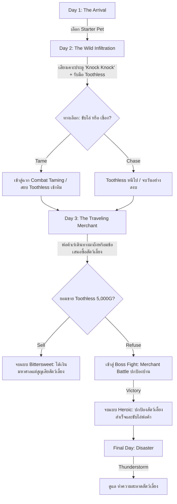

# BePal — Game Concept

## Elevator Pitch

**“BePal is a hardcore pet-care management simulation where domestic warmth collides with uncanny survival peril: care for abnormal creatures through rigorous time and energy budgeting, survive unexpected environmental disasters and lethal wild incursions, and confront moral dilemmas when shady merchants come knocking.”**

> **สโลแกนแนวคิด:** เกมจำลองการบริหารและดูแลสัตว์เลี้ยงผิดปกติ (Abnormal Pets) ที่ผสมผสานความน่ารักอบอุ่นของสัตว์เลี้ยง (Virtual Pet) เข้ากับความท้าทายและการเอาตัวรอดสุดขั้ว (Hardcore Survival) ทุกการตัดสินใจใช้พลังงานและเงินตรามีผลลัพธ์ถึงชีวิต ปกป้องพวกมันจากภัยพิบัติ สัตว์ป่าดุร้าย และข้อเสนออันดำมืดของพ่อค้าเร่

> **เกมเราคือเกมอะไร (จาก Figma — 01 · Game Overview):** "BePal คือเกมแนว **Endless Survival Management** ที่ผู้เล่นจะได้รับบทเป็นผู้ดูแลสถานพักพิงสัตว์อวกาศเพียงลำพังบนดาวเคราะห์สุดขอบจักรวาล ต้องบริหารพลังงานที่มีจำกัดในแต่ละวันเพื่อป้อนอาหาร ทำความสะอาด และรับมือกับภัยคุกคามปริศนาที่มาเคาะ 'ประตูแดง' หน้าฐาน"

---

## Genre, Platform & Controls

- **Genre:** Hardcore Pet-Care Simulation | Resource Management | QTE Reflex Combat | Narrative Choice
- **Platform:** PC (Windows DesktopGL)
- **Engine:** MonoGame (.NET 8 C# 12)
- **Controls (การควบคุม):**
  - `W` `A` `S` `D` หรือ `Mouse`: เลือกเมนูและโต้ตอบ (Interact) กับสิ่งต่างๆ ภายในห้อง
  - `Spacebar`: กดแอ็กชันวงล้อ QTE, ปัดป้อง/หลบหลีก (Dodge), และยืนยันการเลือก
  - `E`: สิ้นสุดวัน (End Day) ข้ามไปยังช่วงค่ำ/สรุปวัน หรือเปิดรับเหตุการณ์หน้าประตู ("Knock Knock !!")
  - `1` `2` `3` `4`: ชอร์ตคัตคำสั่งดูแล (Train, Feed, Clean, Heal)
  - `B` / `S`: เปิดกระเป๋าเก็บไอเทม (Backpack 8 ช่อง) / เปิดร้านค้าพ่อค้าเร่ (Shop)
- **Target Audience:** ผู้เล่นที่ชื่นชอบเกมดูแลสัตว์เลี้ยงสไตล์คลาสสิก (Tamagotchi / Digimon V-Pet) แต่ต้องการความตื่นเต้นระทึกขวัญ ความเสี่ยงสูง (High Stakes) และระบบการต่อสู้หลบหลีกที่ต้องอาศัยทักษะความแม่นยำ

---

## Game Pillars (จาก Figma)

| Pillar | ความหมาย |
| --- | --- |
| **Observation & Understanding** | การสังเกตพฤติกรรมและทำความเข้าใจกฎเกณฑ์เฉพาะตัวของสัตว์คือหัวใจสำคัญ |
| **Cozy yet Dangerous** | บรรยากาศดูปลอดภัยและอบอุ่น ขัดแย้งกับความอันตรายที่ซ่อนอยู่ในตัวสัตว์เลี้ยง |
| **Consequential Interaction** | ทุกการกระทำมีผลลัพธ์ที่ชัดเจนและแตกต่างกันไปตามบริบท |

## Core Pillars (Systems)

1. **Care × Hardcore Peril (การดูแลที่แฝงความตายรอบด้าน):**
   ไม่ใช่แค่การเลี้ยงสัตว์เพื่อความเพลิดเพลิน แต่เป็นสมรภูมิการจัดสรรทรัพยากรเพื่อความอยู่รอด สัตว์เลี้ยงมีค่าสเตตัสความต้องการพื้นฐาน (Stomach, Clean, Health) ที่ลดลงอย่างต่อเนื่อง และสามารถล้มป่วย บาดเจ็บ หรือเสียชีวิตได้จริงหากผู้เล่นละเลย

2. **Discrete Energy & Resource Economy (การบริหารพลังงานและเศรษฐกิจที่จำกัด):**
   ในแต่ละวัน ผู้เล่นได้รับโควตาพลังงานจำกัด (**เริ่มต้น 3 AP อัปเกรดได้สูงสุด 6 AP**) ทุกการกระทำ—ให้อาหาร ทำความสะอาด ฝึกซ้อม หรือรักษาพยาบาล—ล้วนกินพลังงาน การใช้เงิน (Gold) ซื้ออาหาร ยารักษา หรืออุปกรณ์เสริมจากร้านค้าต้องผ่านการคำนวณอย่างรอบคอบ

3. **Precision QTE Mechanics (ความแม่นยำในการตอบสนอง):**
   การดูแลทุกหมวดหมู่และการเผชิญหน้าในสถานการณ์ต่อสู้ควบคุมผ่านระบบ Quick Time Events (QTE) 10 ครั้งต่อรอบ ที่มีทั้ง **Perfect Zone** ($\pm 0.20 \text{ rad}$) และ **Great Zone** ($\pm 0.45 \text{ rad}$) (Figma ใช้คำว่า *Great* แทน *Good*) วงล้อแต่ละแบบมีลูกเล่นต่างกัน (Train/Feed/Clean/Heal) รวมถึงระบบหลบหลีกการโจมตี (Dodge QTE) และการโจมตี (Attack)

4. **Consequential Moral Dilemmas (ทางเลือกและผลลัพธ์เชิงจริยธรรม):**
   เนื้อเรื่องขับเคลื่อนด้วยทางเลือกที่มีน้ำหนักจริง เช่น การตัดสินใจว่าจะยอมเสี่ยงชีวิตฝึกสัตว์ป่าดุร้าย หรือขับไล่มันไป และการเลือกว่าจะยอมขายสัตว์เลี้ยงที่ร่วมทุกข์ร่วมสุขมาเพื่อเงินก้อนโต หรือยืนหยัดปกป้องพวกมันจนนำไปสู่การปะทะกับบอส

---

## Setting & Narrative

### Core Theme & Mood (จาก Figma)
- **Theme:** Cozy Sci-Fi meets Hardcore Survival (ความอบอุ่นที่แฝงความตึงเครียด)
- **Visual:** ห้องพักพิงที่ดูอบอุ่น โดดเดี่ยว แสงไฟสลัวๆ ตัดกับความลึกลับของอวกาศภายนอก
- **Feeling:** ความผูกพันจากการดูแลสัตว์ ขัดแย้งกับความกดดัน (High-Stakes) ที่ต้องตัดสินใจเด็ดขาดเมื่อทรัพยากรไม่พอ หรือเมื่อต้องเผชิญหน้ากับความตาย (Permadeath)
- **Key Colors:** ส้ม/เหลืองอุ่นๆ บรรยากาศครึ้มในฐานทัพ ตัดกับสีแดงเตือนภัยจากเหตุการณ์หน้าประตู

### World-Building (จาก Figma)
- **The Sanctuary:** ฐานพักพิงเล็กๆ กลางดาวเคราะห์รกร้าง มีแกนกลางที่มีแสงไฟอุ่นๆ เป็นเซฟโซนเดียวท่ามกลางความมืดของอวกาศ
- **The Red Door:** ประตูเหล็กสีแดง ทางออกเดียวสู่โลกภายนอก และต้นตอของเหตุการณ์สุ่มทุกอย่างในเกม (สัตว์หลงทาง, พายุอวกาศ, พ่อค้าจอมขูดรีด)
- **The Economy:** โลกที่ขับเคลื่อนด้วยเงินตรา (Coin/Gold) อย่างโหดร้าย ไม่มีใครช่วยใครฟรีๆ ทุกอย่างมีราคา แม้กระทั่งการชุบชีวิต
- **The Antagonists:** ความไร้ปรานีของระบบนิเวศอวกาศ พ่อค้าหน้าเลือดที่มองสัตว์เป็นแค่สินค้า และสัตว์ต่างๆ ที่มาเยือนดาว ทั้งดีและไม่ดี

### The Setting (สถานที่และบรรยากาศ)
**ฐานพักพิงกลางดาวรกร้าง (แรงบันดาลใจจากฐานใน Kingdom: Classic):** มองแบบ 2D Side-View ฐานมี **แกนกลาง (Core Hearth)** เล็กๆ ที่มีแสงไฟส้มอุ่นเป็นจุดศูนย์กลางของชีวิตในฐาน รอบนอกคือความมืดและภูมิประเทศรกร้างของดาว
- **ประตูแดงอยู่ที่ขอบฐาน:** เป็นเส้นแบ่งระหว่างฐานที่อบอุ่นกับโลกภายนอกที่ไม่แน่นอน ทุกสิ่งที่มาเคาะประตูมาจากความมืดด้านนอก

สิ่งอำนวยความสะดวกภายในฐาน (ตั้งเรียงตามแนวนอนจากแกนกลางออกไป):
- **มุมพักผ่อนและให้อาหาร:** เบาะนอน ชามข้าว และแท่นสังเกตการณ์สัตว์เลี้ยง
- **คอนโซลบริหารจัดการ (HUD Console):** แสดงสถานะค่าพลังงาน (Energy AP), วันที่ (Day), จำนวนเงิน (Gold), และเลเวลของผู้เล่น (Player Level & EXP Bar)
- **สถานีอัปเกรดฐาน (Upgrade Station):** พัฒนาทักษะ 3 สาย (QTE Zone, Max Energy, Progress Booster)
- **โต๊ะคลินิกและคุณหมอ (Doctor NPC):** ชุบชีวิตสัตว์เลี้ยงฉุกเฉิน (500G Revive) เมื่อ HP = 0
- **ชั้นวางอุปกรณ์และโต๊ะบันทึก (Survival Desk):** ค้นหาสมุดบันทึกสัตว์เลี้ยง (Pet Discovery) และบันทึกภัยพิบัติ (Disaster Log)
- **ประตูแดงคู่ (Front Door):** จุดเชื่อมต่อสู่โลกภายนอก ("Knock Knock !!") จุดเริ่มต้นของเหตุการณ์ประจำวัน

### Protagonist (ตัวละครเอก)
**The Lone Sanctuarist (ผู้ดูแลสถานพักพิง):** สิ่งมีชีวิตปริศนารูปร่างคล้ายมนุษย์ (Humanoid) ที่อุทิศตัวดูแลสัตว์หลงทาง ไม่มีใครรู้ที่มาที่ไป และมีพลังงานจำกัดในแต่ละวัน — ผู้ดูแลที่มีความมุ่งมั่นในการให้ที่พักพิงแก่สัตว์ประหลาดที่ไม่สามารถปรับตัวเข้ากับระบบนิเวศทั่วไปได้ ต้องรับมือทั้งปัญหาค่าใช้จ่าย ภัยพิบัติทางธรรมชาติ และการคุกคามจากภายนอก

### Starter Pets (สัตว์เลี้ยงเริ่มต้น 3 สายพันธุ์ / สัตว์ปริศนาประจำสถานพักพิง)

| สายพันธุ์ & ฉายา | บุคลิก & ลักษณะเด่น                                                        | สเตตัสเริ่มต้น            | แอ็กชันที่ชอบ    | สกิลติดตัว (Passive)                                                  |
| ---------------- | -------------------------------------------------------------------------- | ------------------------- | ---------------- | --------------------------------------------------------------------- |
| **Mossling**     | สิ่งมีชีวิตกึ่งพืช นุ่มฟูคล้ายตะไคร่น้ำ ดวงตากลมโต รักสงบ ตกใจง่าย         | HP: 100 / St: 80 / Cl: 70 | **Feed, Clean**  | *Photosynthesis:* ได้รับฟื้นฟู Health +5 อัตโนมัติเมื่อค่า Clean > 80 |
| **Nibbleclaw**   | สิ่งมีชีวิตคล้ายแมวผสมตัวกินมด มีกรงเล็บแหลมยาวซ่อนใต้ขน คล่องแคล่ว ว่องไว | HP: 90 / St: 70 / Cl: 80  | **Train, Clean** | *Agile Reflex:* ขยายหน้าต่าง Perfect Zone ในมินิเกม Train ขึ้น +15%   |
| **Blinkbun**     | กระต่ายหูยาวขนสีม่วงเข้ม มีดวงตาที่สามตรงหน้าผาก ลึกลับ อดทนสูง            | HP: 110 / St: 60 / Cl: 60 | **Heal, Feed**   | *Shadow Barrier:* ลดความเสียหายจากการพลาดใน Dodge QTE ลง 25%          |

### กฎความสะอาดและสภาพความพร้อมสู้ (Combat Readiness Rule)
- **Clean ≤ 50 (สกปรก):** การโจมตีของสัตว์เลี้ยงจะเบาลง (Figma Scene 7)
- **Clean ≤ 25 (สกปรกมาก):** ลด Max HP ของสัตว์เลี้ยงตัวนั้นด้วย (Figma Scene 7)
- **Stomach = 0 (หิวโซ):** สัตว์เลี้ยงเสีย HP 20 ทุกครั้งที่ End day (Figma Scene 6)

> ~~Clean < 50 ปฏิเสธที่จะออกไปต่อสู้ (Refuse to Fight)~~ — ยกเลิกแล้ว ใช้กฎลดพลังโจมตี/Max HP ตาม Figma แทน

### Narrative Arc & Mystery (แก่นเรื่องและไทม์ไลน์ Vertical Slice: Day 1 - 3+)

> **หมายเหตุจาก Figma (07 · Game Flow (Event)):** Event เกิดหลังผู้เล่นกด **End day** แล้วขึ้นวันใหม่ ประตูจะขึ้น "Knock Knock !!" (กดประตูได้ตั้งแต่ **Day 2** เป็นต้นไป — Day 1 เป็นวันให้ผู้เล่นทำความรู้จักระบบ) และ Event จะ **สุ่มเกิด 3 แบบ**: เจอสัตว์ตัวใหม่ · เจอพ่อค้า · เจอภัยธรรมชาติ
> ไทม์ไลน์ด้านล่าง (Day 2 = Toothless, Day 3 = Merchant) คือลำดับที่ใช้ใน **Vertical Slice / Prototype** ตามภาพ mockup ใน Figma ส่วนเกมเต็มใช้ระบบสุ่ม

1. **Day 1 — The Arrival (การเริ่มต้น):**
   - ผู้เล่นเปิดร้าน เลือก Starter Pet ตัวแรก (Coco, Sproutlet, หรือ Gloomtail)
   - เรียนรู้ระบบพื้นฐาน: การจัดสรรพลังงาน 6 แต้ม, การให้อาหาร (Feed), ทำความสะอาด (Clean), และฝึกฝน (Train)

2. **Day 2 — The Wild Infiltration & Taming (ผู้มาเยือนปริศนา):**
   - มีเสียงเคาะประตูปริศนาดังขึ้น (**"Knock Knock !!"**)
   - พบสัตว์ประหลาดร่างดำดุร้ายที่มีกรดกัดกร่อน (**Toothless**) บุกเข้ามา
   - **ทางเลือกสำคัญ:** 
     - *Chase:* ขับไล่ไปอย่างปลอดภัย (ไม่เสี่ยงเจ็บตัว แต่ไม่ได้สัตว์เพิ่ม)
     - *Tame:* เข้าสู่ระบบการต่อสู้และฝึกให้เชื่อง (Taming Encounter) ต้องหลบกรดพิษ (Acid Dodge) และสวนกลับจนได้เป็นสัตว์เลี้ยงตัวที่สอง (หากสัตว์ที่ส่งไปสู้ HP หมด จะกลับไปเลือกสัตว์ตัวอื่นมาสู้ต่อ โดยความคืบหน้าการต่อสู้ยังคงอยู่ ถ้าสัตว์ตายหมดทุกตัว = Game Over / สัตว์ที่ HP = 0 ชุบชีวิตได้ที่ Doctor 500)
     - *Chase:* กลับหน้าฐานทันที ไม่ต้องสู้ และ **ไม่เสีย Energy**

3. **Day 3 — The Traveling Merchant & The Moral Crossroads (พ่อค้าเร่และทางแยกแห่งจิตใจ):**
   - พ่อค้าเร่ปริศนาแวะมาเยือน เปิดร้านขายไอเทมพิเศษ (**Crab Apple, Sea Tea, Cloudy Glasses, Torn Notebook, Ballet Shoes, Toy Knife, Faded Ribbon**)
   - พ่อค้าสังเกตเห็น Toothless และยื่นข้อเสนอซื้อตัวด้วยเงินสดมหาศาล (**5,000 Gold**)
   - **ทางแยกแห่งผลลัพธ์:**
     - *ยอมรับข้อเสนอ (Sell):* ได้รับเงิน 5,000G ปลดหนี้และจบวันด้วยความร่ำรวย แต่สูญเสีย Toothless ตลอดกาล (Ending A)
     - *ปฏิเสธข้อเสนอ (Refuse):* พ่อค้าโกรธเกรี้ยว นำไปสู่การต่อสู้ระดับบอส (**Merchant Boss Fight**) ผู้เล่นและสัตว์เลี้ยงต้องร่วมมือกันต่อสู้จนคว้าชัยชนะ (Ending B)

1. **Final Day — The Disaster (ภัยธรรมชาติ):**
   - มีเสียงเคาะประตูดังขึ้น (**"Knock Knock !!"**)
   - มีข้อความขึ้นบอกผู้เล่นว่าวันนี้มีพายุหนักโหมกระหน่ำรอบฐาน (**Thunderstorm**) ทำให้สัตว์ของเราสกปรกทุกตัว ค่า Clean ลดฮวบ และต้องบริหารพลังงานฉุกเฉินเพื่อปลอบประโลม

---

## Inspiration & Competitor Analysis

### Game References

| ผลงานอ้างอิง | องค์ประกอบที่นำมาปรับใช้ใน BePal | จุดแตกต่างและวิวัฒนาการของ BePal |
| --- | --- | --- |
| **Tamagotchi / Digimon V-Pet** | วงจรการให้อาหาร ทำความสะอาด ฝึกซ้อม และความเสี่ยงจากการปล่อยปละละเลย | เพิ่มระบบจังหวะ QTE แบบแอ็กชัน และการตัดสินใจเชิงกลยุทธ์ผ่าน Energy Budget |
| **Undertale / Deltarune** | ระบบการหลบหลีกการโจมตีแบบเรียลไทม์ (Dodge Mechanics) และบุคลิกบอสที่มีเอกลักษณ์ | เชื่อมโยงความพร้อมในการต่อสู้เข้ากับความสมบูรณ์ของค่าสเตตัสการดูแล |
| **Lobotomy Corporation** | ความตื่นเต้นระทึกขวัญของการจัดการสิ่งมีชีวิตผิดปกติที่มีอันตรายถึงตาย | บรรยากาศเน้นความ Cozy อบอุ่น สัมผัสได้ใกล้ชิด ไม่ใช่ความสยองขวัญเลือดสาดแบบโรงงานปิด |
| **Papers, Please** | การจัดสรรทรัพยากรที่ตึงเครียด รายงานสรุปผลประจำวัน และแรงกดดันทางการเงิน | ถ่ายทอดผ่านการดูแลสัตว์เลี้ยงที่มีชีวิตจิตใจ มีการตอบสนองทางอารมณ์ชัดเจน |

### Competitor Analysis — เกมแนว 2D Side-Scrolling / Side-View (จาก Figma — 03 · Concept Design)

| สิ่งที่มี / เกม | Kingdom: Classic | Kingdom Two Crowns | This War of Mine | Kingdom Eighties | Sheltered |
| --- | :-: | :-: | :-: | :-: | :-: |
| มุมมอง 2D Side-Scrolling / Side-View | ✓ | ✓ | ✓ | ✓ | ✓ |
| ระบบกลางวัน–กลางคืน | ✓ | ✓ | ✓ | ✓ | ✓ |
| ศัตรู/ผู้บุกรุกเข้ามาโจมตีฐาน | ✓ | ✓ | ✓ | ✓ | ✓ |
| ใช้เงิน/เหรียญเป็นทรัพยากรหลัก | ✓ | ✓ | ✗ | ✓ | ✗ |
| ระบบสร้าง/อัปเกรดฐาน | ✓ | ✓ | ✓ | ✓ | ✓ |
| จ้าง/สั่งงาน NPC | ✓ | ✓ | ✓ | ✓ | ✓ |
| ตัวละครมีค่าสถานะต้องดูแล | ✗ | ✗ | ✓ | ✗ | ✓ |
| มีสัตว์เลี้ยงที่ต้องดูแล | ✗ | ✗ | ✗ | ✗ | ✓ |
| ตายถาวร (Permadeath) | ✓ | ✓ | ✓ | ✗ | ✓ |
| มีคนมาเคาะประตู/แลกเปลี่ยน | ✗ | ✗ | ✓ | ✗ | ✓ |
| มีทางเลือกด้านศีลธรรม | ✗ | ✗ | ✓ | ✗ | ✓ |
| มีเนื้อเรื่องเล่าชัดเจน | ✗ | ✗ | ✓ | ✓ | ✗ |
| มีพาหนะ/สัตว์ที่มีความสามารถต่างกัน | ✗ | ✓ | ✗ | ✗ | ✗ |
| เล่น Co-op ได้ | ✗ | ✓ | ✗ | ✗ | ✗ |
| แทบไม่มีตัวหนังสืออธิบาย | ✓ | ✓ | ✗ | ✗ | ✗ |

**สิ่งที่ BePal เอามาปรับใช้:**
- **จาก Kingdom:** ใช้ Gold/Coin เป็นทรัพยากรหลักที่ต้องตัดสินใจว่าจะใช้กับอะไร, ควบคุมด้วยปุ่มไม่กี่ปุ่ม
- **จาก This War of Mine / Sheltered:** ฉากห้องพักพิงแบบ Side-View, ค่าสถานะที่ต้องดูแล (หิว/สุขภาพ), คนมาเคาะประตูพร้อมทางเลือกด้านศีลธรรม
- **จุดต่างของ BePal:** เปลี่ยนจากการป้องกันอาณาจักรหรือเอาตัวรอดเอง มาเป็นการดูแลสัตว์

---

## Art & Visual Direction

**แนวทางหลัก (จาก Figma — 03 · Concept Design):** ทำให้บ้านรู้สึกอบอุ่น นุ่มนวล สบายตา แต่สัตว์เลี้ยงต้อง "แปลก" (*pet look normal but something wrong*) และสร้างความรู้สึกไม่สบายใจเล็กน้อยโดยไม่ตกไปเป็นสยองขวัญ — ความรู้สึกเป้าหมาย: อบอุ่น · น่ารัก · ลึกลับ · ปลอดภัย · สบายใจ

- **Visual Style (แนะนำ):** **Soft Hand-drawn + Uncanny Details** — เส้นนุ่ม เงาสีอบอุ่น สัตว์วาดสไตล์เดียวกันแต่ใส่รายละเอียดผิดปกติเล็กน้อย (ตาใหญ่เกิน/ตาเยอะกว่าปกติ, ลายขนหรือสีที่ไม่สมเหตุสมผล, การเคลื่อนไหวช้าหรือแปลก) อารมณ์คล้าย Spiritfarer + Cozy Grove
  - *ทางเลือก:* Soft Pixel Art ความละเอียดกลาง-สูง (อ้างอิงบรรยากาศ Animal Well + ความอบอุ่น Stardew Valley)
  - ความละเอียด Backbuffer 1280x720
- **Color Palette:** โทนอุ่นเป็นหลัก (ครีม น้ำตาลอ่อน เขียวมิ้นต์ แสงโคมไฟส้มอ่อน) + สีเย็นหรือเทาแทรกในตัวสัตว์ และสีแดงเตือนภัยจากประตูแดง — เน้นสว่าง โทนสีอบอุ่น (Mood Board)
- **องค์ประกอบที่ควรยึด:** บ้าน = แสงอุ่น เฟอร์นิเจอร์นุ่ม · สัตว์ = รูปร่างน่ารัก + รายละเอียดผิดปกติ · Animation = ช้า นุ่มนวล แต่มี idle ที่แปลก ("มันกำลังมองเรา") · UI = เรียบง่าย ฟอนต์นุ่ม สีไม่ฉูดฉาด
- **สิ่งที่ควรหลีกเลี่ยง:** สัตว์น่ารักเกินไปแบบ Animal Crossing (เสียความ uncanny), สไตล์มืดหรือเลือดสาด (เสียความ cozy), เส้นคมและสีสดจัดเกินไป
- **Expressive Cues:** สัตว์เลี้ยงมี Sprite แสดงอารมณ์ละเอียด (Idle, Hungry, Distressed, Angry, Joyful) พร้อม Visual VFX บอกใบ้จังหวะ QTE
- **Audio Direction:**
  - **Soundtrack:** Lo-Fi Acoustic Guitar / Warm Electric Piano สำหรับช่วงเวลาดูแลในห้องพัก และแปรเปลี่ยนเป็น Up-tempo Chiptune Synthwave ผสมจังหวะกลองเขย่าขวัญในฉากต่อสู้ Boss Fight
  - **SFX:** เสียง Typewriter เวลาอ่านข้อความ, เสียงหยดน้ำ/สบู่ในโหมด Clean, เสียงเคี้ยวกรุบกรอบในโหมด Feed, และเสียงสะท้อนโลหะ (Metallic Parry) เมื่อกด Dodge สำเร็จ
