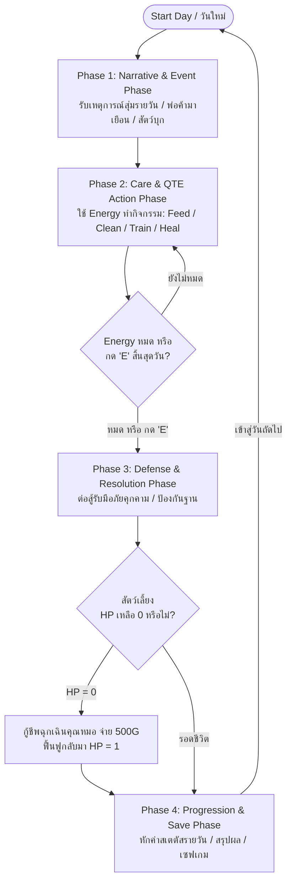
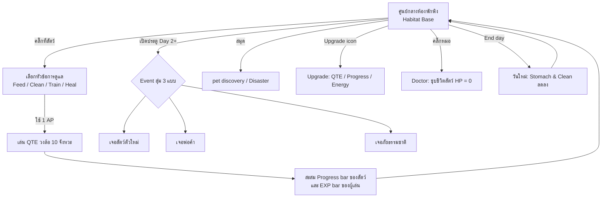
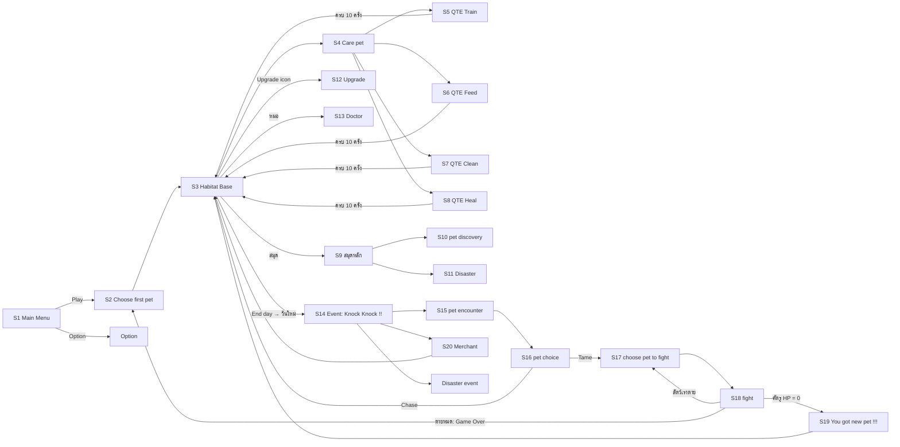

# BePal — Core Loop & Gameplay Flow

## Core Daily Loop

วงจรการเล่นหลักของ BePal ถูกออกแบบให้เป็นวัฏจักรประจำวัน 4 เฟส (4-Phase Daily Loop) ที่ผู้เล่นต้องบริหารจัดการเวลา พลังงาน และสถานะของสัตว์เลี้ยง ท่ามกลางวิกฤตและเหตุการณ์ไม่คาดฝัน:

---

### Core Loop ตาม Figma (05 · Game Loop)

> ลำดับจริงใน Figma: ผู้เล่นกด **End day** ได้ทุกเมื่อ → ขึ้นวันใหม่ (ค่า Stomach และ Clean ลดลง เพื่อกันการ skip day โดยไม่ทำอะไร) → ตั้งแต่ Day 2 ประตูจะมี "Knock Knock !!" ให้คลิ๊กเปิดรับ Event

---

## Detailed Breakdown of the 4-Phase Daily Cycle

### Phase 1: Narrative & Morning Event Phase (ยามเช้าและข่าวสาร)
1. **Morning Briefing:** เมื่อเริ่มต้นวันแรก ระบบจะยังไม่มี event อะไร เพื่อให้ผู้เล่นได้เรียนรู้กับระบบเสียก่อน
2. **Doorstep Arrival Check:** ในวันที่กำหนด (เช่น Day 2 มีเสียง "Knock Knock !!", Day 3 มีรถเข็นพ่อค้าเร่มาจอด) ประตูแดงคู่จะมีไอคอนแจ้งเตือนให้ผู้เล่นตรวจสอบเหตุการณ์ภายนอก

### Phase 2: Care & QTE Action Phase (การดูแลและบริหารพลังงาน)
1. **Energy Budgeting:** ผู้เล่นได้รับแต้มพลังงานเริ่มต้น **3 AP** ต่อวัน (อัปเกรดเพิ่มได้ที่ Upgrade → Energy สูงสุด 6 AP) — **กดเข้าหน้า QTE = -1 Energy**
2. **Action Selection:** ผู้เล่นเลือกทำกิจกรรมการดูแลจาก 4 หมวดหมู่หลัก:
   - **Feed (ให้อาหาร):** ใช้ 1 AP ฟื้นฟูค่า Stomach และให้ EXP player
   - **Clean (ทำความสะอาด):** ใช้ 1 AP ขจัดสิ่งสกปรก ฟื้นฟูค่า Clean เพื่อไม่ให้สัตว์เลี้ยงสกปรก หาสัตว์เลี้ยงสกปรก สัตว์ตัวนั้นจะโจมตีเบาลงและถ้าหากสัตว์ตัวนั้นไม่มีความสะอาดเลย จะทำให้ max hp ลดลงอีกด้วย
   - **Train (ฝึกฝนทักษะ):** ใช้ 1 AP เพิ่มระดับเลเวลสัตว์เลี้ยงและ EXP player แต่ลดค่า Stomach
   - **Heal (รักษาพยาบาล):** ใช้ 1 AP (หรือร่วมกับไอเทมยา) ฟื้นฟูค่า Health ที่สูญเสีย
3. **Action Select Wheel (Scene 4 — Care pet):** คลิ๊กที่สัตว์ → วงล้อ QTE ที่มี choice 4 สี (Train/Feed/Clean/Heal) กด Spacebar ตรง choice ไหนจะไปหน้า QTE นั้น (กดไม่โดน = ไม่เกิดอะไรขึ้น), ESC = กลับหน้า Base, กดโดนแล้วจอสั่น (feedback)
4. **10-Attempt Mini-Game Execution:** แต่ละแอ็กชันจะตัดเข้าสู่หน้าจอมินิเกมวงล้อ QTE — กด Spacebar ได้ **10 ครั้ง** (Attempt : 10) ผู้เล่นต้องจับจังหวะกดในโซน Perfect หรือ Great เมื่อกดครบจะกลับ Scene Base อัตโนมัติ
4. **Day Progress Accumulation:** ผู้เล่นจะสามารถไปวันต่อไปได้โดยการกดคีย์ `E` สิ้นสุดวันเพื่อข้ามช่วงเวลา

### Phase 3: Defense & Resolution Phase (การเผชิญหน้าและการต่อสู้)
1. **Combat Readiness Condition (กฎความสะอาดก่อนออกรบ):**
   - **Clean < 50:** หากค่าความสะอาดต่ำกว่า 50 สัตว์เลี้ยงจะโจมตีเบาขึ้น (จาก 20 --> 15) และถ้าหากค่าความสะอาด < 25 จะทำให้ max hp ขอวสัตว์ตัวนั้นลดลงอีกด้วย (100 --> 80)
1. **Dynamic Encounters:**
   - **Day 1:** เริ่มต้นวันแรก สำรวจสิ่งรอบข้าง เรียนรู้ระบบ 
   - **Day 2 (Toothless Encounter):** สัตว์ป่ากรดพิษบุกเข้ามา ผู้เล่นต้องเลือกว่าจะขับไล่ (Chase) หรือฝึกให้เชื่อง (Tame Combat QTE)
   - **Day 3 (Merchant Boss Battle):** หากปฏิเสธข้อเสนอขายสัตว์เลี้ยง พ่อค้าจะเปลี่ยนร่างเข้าสู่การต่อสู้ 3 เฟส
   - **Final Day (Disaster):** รับมือกับ พายุ (Thunderstorm) ที่จะทำให้สัตว์ทุกตัวของคุณสกปรก(ค่าความสะอาด = 50) ผู้เล่นจะต้องทำความสะอาดพวกมัน
1. **Combat Loop (Scene 16–19 ใน Figma):**
   - **Pet choice:** เลือก *Chase* (กลับฐาน ไม่ต้องสู้ ไม่เสีย Energy) หรือ *Tame* (เข้าสู่การต่อสู้)
   - **Choose pet to fight:** คลิ๊กเลือกสัตว์ของเราที่จะส่งไปสู้ (hover ขึ้นกรอบรอบตัว)
   - **Fight:** มีหลอด HP ของศัตรู และหลอด HP เล็กๆ บนหัวสัตว์ของเรา วงล้อ QTE มี 2 choice:
     - **Dodge:** มีแค่ zone Perfect ที่ค่อยๆ หดสั้นลง ต้องกดให้โดน ถ้ากดไม่ทันหรือไม่โดน สัตว์เราจะถูกโจมตี
     - **Attack:** มี zone Perfect (ดาเมจ 100% ของ ATK) และ Great (ดาเมจ 75% ของ ATK) — เช่น ATK 100 → Perfect 100 / Great 75
   - ศัตรู HP = 0 → หน้า "You got new pet !!!" (รับสัตว์ตัวใหม่)
   - สัตว์เราตาย (HP = 0) → กลับหน้าเลือกสัตว์เพื่อส่งตัวอื่นมาสู้ต่อ โดย **progress การสู้ยังอยู่** จนกว่าศัตรูจะ HP = 0
   - สัตว์เราตายหมด → **Game Over** แล้วกลับไปเริ่มเลือกสัตว์ใหม่ที่ Scene 2

### Phase 4: Progression & Summary Phase (การสรุปผลและฟื้นฟู)
1. **Daily Stat Decay:** หักลบค่าสเตตัสความต้องการพื้นฐานตามสูตรประจำวัน (Stomach -20, Clean -15) — ทุกครั้งที่เริ่มวันใหม่
2. **Sickness & Penalty Check:** Stomach = 0 → เสีย HP 20 ทุกครั้งที่ End day / Clean ≤ 50 → โจมตีเบาลง / Clean ≤ 25 → Max HP ลดลง
3. **Daily Summary Report Card:** นำเสนอผลประเมินเกรด (S, A, B, C, F) สรุปคะแนนสะสม โบนัสเงินรางวัล (Gold Reward ที่ได้จากพ่อค้า หรือ การต่อสู้) และปลดล็อกบันทึก Survival Log
4. **Night Rest:** บันทึกข้อมูลเซฟเกม (Auto-save) และรีเซ็ตพลังงานกลับเป็น 6 แต้มสำหรับวันถัดไป

---

## The Vertical Slice Progression Timeline (Day 1 - 3+)

| วันที่               | Phase 1 (Event)                                                                                                        | Phase 2 (Care Focus)                                                                       | Phase 3 (Encounter / Conflict)                                                                                                                            | Phase 4 (Resolution)                                                                               |
| -------------------- | ---------------------------------------------------------------------------------------------------------------------- | ------------------------------------------------------------------------------------------ | --------------------------------------------------------------------------------------------------------------------------------------------------------- | -------------------------------------------------------------------------------------------------- |
| **Day 1**            | - รับสัตว์เลี้ยงเริ่มต้น (Coco/Sproutlet/Gloomtail หรือ ไอ่แดง/ไอ่ซุง/ไอ่เขียว)                                     | - ทำความคุ้นเคยกับการใช้ Energy ทำกิจกรรมดูแลสัตว์                                         | - สำรวจเกมเบื้องต้น (ยังไม่มีการต่อสู้หรือภัยพิบัติ เพื่อให้ผู้เล่นทำความเข้าใจระบบการกด QTE)                                                             | - สรุปคะแนนวันแรก - หักค่าสเตตัสรายวัน (Daily Decay) - รับโบนัสเงินสนับสนุนเริ่มต้น          |
| **Day 2**            | - เสียงแจ้งเตือนหน้าประตู "Knock Knock !!" - ร่องรอยคราบกรดสีม่วง                                                   | - บริหารพลังงานและอัปเกรดสถานีฐาน - ตรวจสอบความสะอาดให้อยู่ในเกณฑ์พร้อมรบ (Clean >= 50) | - **Toothless Wild Encounter:** เลือกว่าจะขับไล่ (Chase) หรือฝึกให้เชื่อง (Tame) - เข้าสู่มินิเกมหลบหลีก (Dodge) และสวนกลับ                            | - ปลดล็อก Toothless เข้าเป็นสมาชิกใหม่ (หากเลือก Tame สำเร็จ) - อัปเดตสมุดบันทึก (Survival Log) |
| **Day 3**            | - พ่อค้าเร่เดินทางมาถึง - เปิดระบบร้านค้า (Merchant Shop) ซื้อไอเทมเช่น Crab Apple, Sea Tea ฯลฯ                     | - ซื้อไอเทมบัฟและอาหารฟื้นพลัง - จัดการบริหาร Energy เตรียมพร้อมสัตว์เลี้ยง             | - **The Merchant's Dilemma:** พ่อค้าเสนอเงิน 5,000G เพื่อขอซื้อสัตว์เลี้ยง - หากปฏิเสธ จะเข้าสู่ **Merchant Boss Fight** (ต่อสู้จนกว่าจะตีครบ 5 ครั้ง) | - รับเงินรางวัล (หากต่อสู้ชนะพ่อค้า) - หักค่าสเตตัส สรุปผลประจำวันเพื่อเล่นต่อ                  |
| **Day 4+ (Endless)** | - **ระบบสุ่มเหตุการณ์รายวัน:** - _ตัวอย่าง Event:_ การเผชิญกับภัยธรรมชาติ (เช่น Thunderstorm) หรือมีศัตรูใหม่บุกฐาน | - สัตว์เลี้ยงถูกฝนพายุ ทำให้สัตว์เลี้ยงทุกตัวของเราสกปรก                                   | - บริหาร Energy เพื่อจัดการสถานการณ์ฉุกเฉิน - _ตัวอย่าง:_ พายุทำให้สัตว์สกปรก (Clean = 50) ต้องเลือกใช้ Energy ทำความสะอาด                             | - สุ่มเผชิญหน้ากับการต่อสู้ (Combat QTE) หรือ มินิเกมแก้ปัญหาภัยคุกคามตาม Event ที่สุ่มได้         |

---

## Scene Breakdown (อ้างอิง Figma — 06 · Game Flow Scenes 1–13 และ 07 · Game Flow (Event) Scenes 14–20)

| Scene | หน้าจอ | UI บนหน้าจอ | Programmer | Art |
| --- | --- | --- | --- | --- |
| **1** | Main Menu | BePal, Play, Option, Quit, "Space to Enter" | Play → เลือกสัตว์, Option → setting, ทำ transition เมื่อเปลี่ยน scene | รูป Spacebar + "Space to Enter", รูป WASD, รูปลูกศร, ชื่อเกม "BePal", ปุ่ม Play/Option/Quit, Menu Background |
| — | Option | — | *(ยังไม่มีรายละเอียดในบอร์ด)* | — |
| **2** | Choose first pet | "Choose your pet", ไอ่แดง / ไอ่เขียว / ไอ่ซุง | คลิ๊กเลือกสัตว์, hover ขึ้นกรอบรอบตัวสัตว์, เลือกแล้วเข้า Base | รูปสัตว์, รูปสัตว์กรอบเรืองแสง (hover), dialogue box, Base Background (Blur) |
| **3** | Habitat Base | Day, Coin, ชื่อสัตว์, Player LV + EXP, Upgrade icon, สมุด, End day (E) | คลิ๊กประตู = รับ Event (Day 2+), คลิ๊กสมุด/อัปเกรด/สัตว์/หมอได้, ทำ progress bar, ทุกวันใหม่ Stomach & Clean ลด, End day กดได้ทุกเมื่อ | UI สมุด, UI upgrade, รูปหมอ, รูปประตู, UI energy, progress bar overlay, UI Coin, Text Day, Base Background |
| **4** | Care pet | วงล้อ Train / Feed / Clean / Heal, ESC | วงล้อ QTE 4 choice สี, Spacebar โดน choice ไหนไป scene นั้น (ไม่โดน = ไม่เกิดอะไร), ESC กลับ Base, จอสั่นเมื่อกดโดน | Text แต่ละ choice, UI ESC, Base Background (Blur + dark tone) |
| **5** | QTE Train | EXP, LV, Attempt : 10, Progress Bar | จุดสีแดงเล็ก หลายจุด สุ่มตำแหน่ง (รวม 10 จุด เกิดใหม่จน Attempt = 0), เข็มหมุนเร็วกว่าปกติ, progress bar แยกสี — ดู [03-mechanics §3.2](03-mechanics.md) | progress bar, UI energy ลด, ข้อความ feedback Miss / Perfect / Great, Background (Blur + dark tone) |
| **6** | QTE Feed | Stomach, Attempt : 10 | จุดสีเหลือง (ใหญ่กว่าแดง), กดโดน = เปลี่ยนทิศการหมุน + จุดเกิดใหม่ | *(ไม่ระบุ)* |
| **7** | QTE Clean | Clean, Attempt : 10 | จุดสีฟ้า ขยับหนีไปทิศเดียวกับเข็มแต่ช้ากว่า | *(ไม่ระบุ)* |
| **8** | QTE Heal | Heal, Attempt : 10 | จุดสีเขียว, เข็มกะพริบเฟดหาย/กลับมา, choice ค่อยๆ หดสั้น | *(ไม่ระบุ)* |
| **9** | สมุดหลัก | pet discovery, Disaster, ESC | เลือกหัวข้อ, hover มีกรอบ, ESC กลับ Base, ดูได้เฉพาะสัตว์ที่มี / Disaster ที่เคยผ่าน | background สมุด, pet discovery UI, Disaster UI |
| **10** | สมุด pet discovery | Day, Coin, LV, Stomach, Clean, Health, ไอคอนธาตุ, คำอธิบายสัตว์, ESC | กดลูกศรไปหน้าถัดไป, ESC กลับ Base | *(ไม่ระบุ)* |
| **11** | สมุด Disaster | Day, Coin, ชื่อภัย (เช่น Thunder storm), คำอธิบาย, ESC | กดลูกศรไปหน้าถัดไป, ESC กลับ Base | รูป disaster |
| **12** | Upgrade | Points, Coin, QTE / Energy / Progress Bar + REQ | ดู [03-mechanics §1.3](03-mechanics.md) | Upgrade background, ปุ่ม +, Text QTE/Energy/Progress Bar, (อยากให้มี) icon points |
| **13** | Doctor | Day, Coin, Player LV, "Choose pet", ราคา 500 | ไม่มีสัตว์ HP = 0 → แสดงแค่ "choose pet", มี → แสดงรูป + ราคาชุบชีวิต, หลายตัวใช้ลูกศรเลื่อน, คลิ๊ก → "Are you sure?" Yes = กลับ Base พร้อม HP = 1 / No = กลับหน้าเลือก, ESC กลับ Base | Doctor Background |
| **14** | Event (Knock Knock !!) | "Knock Knock !!", Day, Coin, Player LV, End day | Event เกิดหลังกด End day แล้วขึ้นวันใหม่, สุ่ม 3 แบบ | icon knock |
| **15** | pet encounter | ชื่อสัตว์ (เช่น Toothless) + บทพูด | เกิดเมื่อกดประตูแล้วเจอสัตว์ตัวใหม่, คลิ๊กเพื่อข้ามข้อความ | *(ไม่ระบุ)* |
| **16** | pet choice | Chase, Tame | Chase = กลับฐานไม่ต้องสู้ไม่เสีย Energy, Tame = เข้าสู่การต่อสู้ | *(ไม่ระบุ)* |
| **17** | choose pet to fight | "Choose your pet" | คลิ๊กสัตว์เพื่อเข้าสู่การต่อสู้, hover ขึ้นกรอบ | *(ไม่ระบุ)* |
| **18** | fight | Health, Dodge, Attack, ชื่อท่า (เช่น Acid) | ดู Combat Loop ด้านบน / [03-mechanics §4.2](03-mechanics.md) | *(ไม่ระบุ)* |
| **19** | รับ new pet | "You got new pet !!!" | *(ยังเป็นข้อความทดสอบในบอร์ด)* | *(ไม่ระบุ)* |
| **20** | Merchant | Day, Coin, Merchant: "I'm quite interested your toothless… can you give it to me?" | *(ยังไม่ได้เขียนรายละเอียดในบอร์ด)* | *(ยังไม่ได้เขียนรายละเอียดในบอร์ด)* |

> **ส่วนที่ยังไม่ได้ออกแบบใน Figma:** หน้า Option, หน้า Disaster event (กิ่งที่ 3 ของ Event — บอร์ดยังใช้ข้อความชุดเดียวกับหน้า Upgrade), รายละเอียด Scene 19–20 และ Daily Summary / Emergency Revive modal (ยังคงตาม GDD v2.0 ด้านล่าง)

### ฉากเพิ่มเติมจาก GDD v2.0 (ยังไม่มีใน Figma)

1. **Prologue:** บทสนทนานำเข้าสู่เรื่องราวก่อนเลือกสัตว์เลี้ยง
2. **Morning Briefing:** การแจ้งเตือนเหตุการณ์ประจำวัน
3. **Daily Summary Report Card & Night Rest Screen:** หน้าต่างสรุปผลรายวันสไตล์ _Papers, Please_ แสดงผลเกรดการดูแล (S, A, B, C, F) สรุปการหักสเตตัส (Daily Decay) โบนัสเงินรางวัล และบันทึกการเล่นก่อนเข้าสู่วันถัดไป

---

## Controls Mapping

| รูปแบบการควบคุม       | บริบทการใช้งาน          | หน้าที่และผลลัพธ์                                                                                                                                  |
| --------------------- | ----------------------- | -------------------------------------------------------------------------------------------------------------------------------------------------- |
| **Mouse Left Click**  | หน้าจอหลัก / HUD / เมนู | เลือกเมนูการดูแล (Feed/Clean/Train/Heal), เปิดกระเป๋า, เลือกคำตอบในบทสนทนา, และกดคลิกโต้ตอบกับสิ่งต่างๆ ในฐาน (ประตู, คุณหมอ, อัปเกรด, สมุดบันทึก) |
| **W / A / S / D**     | หน้าจอหลัก / ฐาน        | ใช้เป็นปุ่มนำทางเพื่อเลือกวัตถุสิ่งแวดล้อมภายในฐาน (ทางเลือกเสริมแทนการใช้เมาส์)                                                                   |
| **Spacebar (Menu)**   | Main Menu / Care pet    | "Space to Enter" ในหน้าเมนู และกดเลือก choice บนวงล้อ Care pet (Train/Feed/Clean/Heal)                                                             |
| **Spacebar (Tap)**    | มินิเกม Care QTE        | กดยืนยันเมื่อเข็มหมุนเข้าสู่โซนความสำเร็จ (Perfect / Great Zone) — กดได้ 10 ครั้งต่อรอบ                                                            |
| **Spacebar (Combat)** | มินิเกม Combat QTE      | กดเมื่อเข็มเข้า choice **Dodge** (Perfect อย่างเดียว หดสั้นลงเรื่อยๆ) เพื่อหลบ หรือ choice **Attack** (Perfect 100% / Great 75% ATK) เพื่อโจมตี     |
| **E Key**             | หน้าจอหลัก              | กดเพื่อ **สิ้นสุดวัน (End Day)** ข้ามช่วงเวลาเข้าสู่ช่วงประมวลผล (Phase 4) ทันที                                                                   |
| **B Key**             | กระเป๋าไอเทม            | เปิดหน้าต่างกระเป๋าเก็บไอเทมเพื่อกดใช้งาน                                                                                                          |
| **Escape (ESC)**      | เมนูและหน้าต่างเสริม    | กลับหน้า Base จาก Care pet / สมุด / Upgrade / Doctor, ปิด Pop-up (Bag) หรือเปิดเมนู Option/Pause                                                   |

---

## Win / Lose & Emergency Revive Conditions

1. **Daily Victory Condition(เงื่อนไขการผ่านแต่ละวัน):**
   - บริหารทรัพยากรและสเตตัสสัตว์เลี้ยงให้อยู่รอดจนสิ้นสุดวัน โดยรักษาค่า Health ไม่ให้ลดลงเหลือ 0 รวมถึงการผ่านมินิเกมและรับมือกับเหตุการณ์สุ่ม (Event) ประจำวันให้สำเร็จ
1. **Incapacitation State (ภาวะสัตว์เลี้ยงหมดสภาพ):**
   - เกิดขึ้นเมื่อสัตว์เลี้ยงได้รับความเสียหายจากการโจมตี หรือป่วยจากค่าสเตตัสวิกฤต (เช่น Stomach = 0) จนค่า Health กลายเป็น 0 ตัวเกมจะยังไม่จบถาวร ผู้เล่นพาสัตว์ไปที่ **หน้า Doctor (Scene 13)** — หน้านี้จะแสดงเฉพาะสัตว์ที่ HP = 0 พร้อมราคาชุบชีวิต (500 Coin) คลิ๊กที่สัตว์ → "Are you sure?" → Yes = กลับ Base พร้อมสัตว์ HP = 1 / No = กลับหน้าเลือกสัตว์ของหมอ
1. **Fail State (การพ่ายแพ้สมบูรณ์ / Game Over):**
   - เกิดขึ้นเมื่อสัตว์เลี้ยง **ตายหมดทุกตัวระหว่างการต่อสู้** (Figma Scene 18) → Game Over แล้วกลับไปเริ่มเลือกสัตว์ใหม่ที่ Scene 2
   - หรือสัตว์เลี้ยงทั้งหมดตาย และผู้เล่นไม่มีเงินหรือช่องทางกู้ชีพเหลืออยู่
1. **Endless Progression (การดำเนินเกมแบบไร้จุดจบ):**
   - หลังจากผ่านเหตุการณ์ช่วง 3 วันแรก (รวมถึงการรับมือกับพ่อค้าใน Day 3) ตัวเกมจะเข้าสู่ลูปการเล่นหลักแบบ Endless ตัวเกมจะทำการสุ่มเหตุการณ์ ภัยธรรมชาติ (เช่น พายุฝน) และศัตรูที่บุกรุกฐานไปเรื่อยๆ เพื่อท้าทายขีดจำกัดของผู้เล่นในการเอาชีวิตรอดให้ได้จำนวนวัน (Day) มากที่สุด
