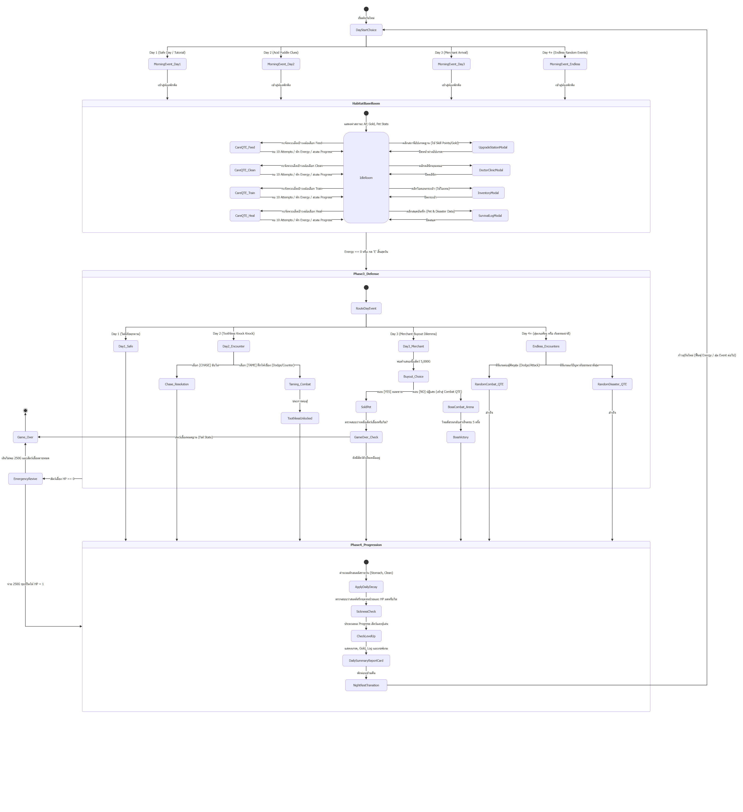

# BePal — Mechanic Design & Systems Specification

> **หมายเหตุ:** ปรับให้ตรงกับโค้ดแล้วเมื่อ 2026-10-07 — [06-vertical-slice.md](06-vertical-slice.md) และโค้ดยังเป็นข้อกำหนดหลักของ Prototype

## State Machine Diagram

> Draw.io: [diagrams/state-machine.drawio](diagrams/state-machine.drawio) (เปิดด้วย VS Code Draw.io Integration)

---
## Section 0: Game Architecture & The Endless Loop

### 0.1 Story & Setting Overview (เรื่องราวและฉากหลัง)

- **The Lone Sanctuarist:** ผู้เล่นรับบทเป็นสิ่งมีชีวิตสายพันธุ์ Humanoid ลึกลับที่อาศัยอยู่เพียงลำพังบนดาวเคราะห์อันห่างไกล โดยเปลี่ยนดาวทั้งดวงให้เป็น "สถานพักพิงสัตว์อวกาศ" (Alien Pet Sanctuary)
- **The Red Door Encounters:** "ประตูแดง" ศูนย์กลางของฐานทำหน้าที่ต้อนรับสิ่งมีชีวิตแปลกประหลาดที่หลงทาง บาดเจ็บ หรือบุกรุกเข้ามา
- **Beyond the Pets:** ภัยคุกคามที่ไม่แน่นอน ทั้งสิ่งมีชีวิตทรงภูมิปัญญาจอมขูดรีด พ่อค้าเร่ หรือภัยพิบัติทางธรรมชาติระดับจักรวาล
### 0.2 Unique Selling Point (USP)

- **Cozy Sci-Fi Sanctuary with Hardcore Survival Peril:** บรรยากาศอบอุ่นที่ซ่อนความตึงเครียดของการเอาชีวิตรอด สัตว์อวกาศมีระบบความต้องการสมจริง (Stomach, Clean) หากพลาดอาจเจ็บป่วยและตายได้
- **Discrete Energy Economy (The Lone Caretaker's Budget):** บีบคั้นการตัดสินใจด้วยแต้ม Energy เริ่มต้นเพียง 3 แต้มต่อวัน (อัปเกรดได้สูงสุด 6) บังคับให้ผู้เล่นต้องจัดลำดับความสำคัญอย่างเด็ดขาด
- **10-Attempt Precision Care QTE Engine:** มินิเกมวงล้อความแม่นยำ 10 จังหวะ ผูกผลลัพธ์เข้ากับระบบ Progression โดยให้รางวัลระดับ High Reward เฉพาะการกดเข้า Perfect Zone
- **The Unpredictable "Red Door" & Dynamic Combat:** สุ่มเจอศัตรูและเหตุการณ์แบบ Endless พร้อมระบบต่อสู้กะจังหวะ Dodge หลบหลีก และ Counter-Attack สวนกลับ
- **High-Stakes Moral Crossroads:** ทางเลือกเดิมพันสูง เช่น การยอมขายสัตว์เลี้ยงแลกเงิน 5,000G ที่อาจนำไปสู่ความล่มสลายและ Game Over หากโลภจนไม่เหลือสัตว์เลี้ยงในฐาน

### 0.3 The Endless Core Loop (โครงสร้างลูปประจำวัน)
_(สามารถนำโค้ด stateDiagram-v2 ที่ร่างไว้มาแปะในส่วนนี้เพื่อให้ทีมเห็น Flow chart ทั้งหมด)_

- **Phase 1: Morning Event** — สุ่มเหตุการณ์หน้าประตู (Safe Day, พายุ, ศัตรูบุก, พ่อค้าเร่)
- **Phase 2: Care & QTE** — บริหาร Energy (เริ่ม 3 AP อัปเกรดสูงสุด 6) เพื่อเข้าวงล้อดูแลสัตว์ (Feed, Clean, Train, Heal)
- **Phase 3: Defense & Resolution** — ตัดสินใจรับมือเหตุการณ์ประจำวัน หรือเข้าสู่ฉาก Combat QTE
- **Phase 4: Progression & Save** — คำนวณหักสเตตัสรายวัน (Decay), ตรวจสอบการเจ็บป่วย, อัปเลเวล และข้ามเข้าสู่วันใหม่

## Section 1: The Sanctuary (Base Systems & UI)
### 1.1 Base Room HUD Layout & Hitboxes
ห้องพักพิงหลัก (Habitat Base Room) เป็นหน้าจอหลักสำหรับการบริหารจัดการ โดยมีองค์ประกอบการโต้ตอบหลักบนหน้าจอดังนี้:

**Top Bar (แถบสถานะผู้ดูแล):**
- - ตัวนับวัน [ Day (ตามจำนวนวันที่รอดชีวิต) ] บ่งบอกถึงความก้าวหน้าในโหมด Endless
- หลอดพลังงาน Energy Pips (เริ่ม 3 ดวง อัปเกรดได้สูงสุด 6 ดวง) สำหรับใช้ทำกิจกรรม
- จำนวนเงินคงเหลือ [ GOLD: 150 G ]
- หลอดเลเวลผู้เล่น [ PLAYER LV. 1 ] พร้อมแถบ EXP (หลอดจะเพิ่มขึ้น +1 ทุกครั้งที่กด QTE โดน ทั้ง Perfect และ Great)
**Center Habitat Stage (พื้นที่พักพิงสัตว์เลี้ยง):**
- แสดง Sprite สัตว์เลี้ยงปัจจุบัน (เช่น ไอ่แดง, ไอ่ซุง, ไอ่เขียว, Toothless) เดินไปมาหรือมีแอนิเมชัน Idle ในห้อง
**Pet Status Interaction (การเช็กสเตตัสสัตว์เลี้ยง):**
- เมื่อตรวจสอบสัตว์เลี้ยง จะแสดงหลอดสเตตัสหลัก 3 อย่าง: **HP** (พลังชีวิต), **Stomach** (ความอิ่ม), และ **Clean** (ความสะอาด) พร้อมแสดง **Level / Progress Bar** ของสัตว์เลี้ยงตัวนั้นๆ
**Command Interaction (การสั่งการดูแลสัตว์เลี้ยง):**
- ผู้เล่นต้อง **"คลิกซ้ายที่ตัวสัตว์เลี้ยง"** เพื่อเปิดหน้าต่างวงล้อคำสั่ง (Action Selection Wheel)
- เข็มจะหมุนไปรอบวงล้อที่มี 4 คำสั่ง ผู้เล่นต้องกด Spacebar เล็งให้ตรงเพื่อเลือก:
	- **[ FEED ]** — ให้อาหาร (ใช้ 1 AP / หิวเพิ่ม)
	- **[ CLEAN ]** — ทำความสะอาด (ใช้ 1 AP / ความสะอาดเพิ่ม)
	- **[ TRAIN ]** — ฝึกซ้อม (ใช้ 1 AP / เพิ่มหลอด Progress เพื่ออัปเลเวล)
	- **[ HEAL ]** — รักษาพยาบาล (ใช้ 1 AP / ฟื้นฟู HP)
**Quick-Access UI Buttons (ปุ่มลัดหน้าจอหลัก):**
- - **[ BAG ] (คีย์ B):** เปิดหน้าต่างกระเป๋าเก็บไอเทมเพื่อกดใช้งานฟื้นฟูสเตตัสสัตว์เลี้ยง
- **[ END DAY ] (เดินไปที่เตียง + `Space`/`Enter`):** สิ้นสุดวัน เพื่อข้ามเวลาไปยังช่วงประมวลผล (Phase 4) ทันที

### 1.2 Environment Objects (วัตถุโต้ตอบในฐาน)
ผู้เล่นสามารถใช้เมาส์คลิกเพื่อโต้ตอบกับสิ่งอำนวยความสะดวกในห้องได้ ดังนี้:

- - **ประตูแดงคู่ (Front Door):** จุดเปิดรับเหตุการณ์และแขกที่มาเคาะประตู ("Knock Knock !!") เพื่อสุ่ม Event ประจำวัน (เช่น สัตว์บุก, พ่อค้าเร่มาเยือน)
- **NPC คุณหมอ (Doctor Clinic):** บริการกู้ชีพสัตว์เลี้ยงฉุกเฉิน ผู้เล่นสามารถจ่ายเงิน 250 Gold เมื่อสัตว์เลี้ยง HP = 0 เพื่อชุบชีวิตให้ฟื้นกลับมามี HP = 1
- **สถานีอัปเกรดฐาน (Upgrade Station / ไอคอนรูปเฟือง):** ใช้แต้ม Skill Points (ที่ได้จากการอัปเลเวลผู้เล่น) และเงิน Gold เพื่ออัปเกรด 3 สาย:
	- **สาย QTE:** ทำให้กด QTE ง่ายขึ้น (ขยายขนาดหน้าต่าง Hit Zone หรือลดความเร็วเข็ม)
	- **สาย Progress Booster:** เพิ่มประสิทธิภาพการดูแล ทำให้หลอด Progress เพิ่มเยอะขึ้นเมื่อกดสำเร็จ (เช่น จากเพิ่มทีละ 10% เป็น 15%)
	- **สาย Energy:** เพิ่มขีดจำกัดพลังงานรายวันให้ผู้เล่น (Max Energy อัปได้สูงสุดไม่เกิน 6 AP)
- **โต๊ะค้นคว้า (Survival Desk / ไอคอนสมุด):** สำหรับเปิดสมุดบันทึก เพื่อดูคำอธิบายของสัตว์เลี้ยง (ข้อมูลธาตุต่างๆ) และรวบรวมบันทึกภัยพิบัติหรือศัตรูที่เคยเผชิญหน้า

> **ประตู (Figma Scene 3):** คลิ๊กประตูเพื่อต้อนรับ Event ได้ตั้งแต่ **Day 2** ขึ้นไป (Day 1 เป็นวันให้ผู้เล่นทำความรู้จักระบบ) — ปุ่ม **End day** กดได้ทุกเมื่อ

### 1.3 Upgrade Station — ค่าใช้จ่ายและผลลัพธ์ (Figma Scene 12)

- **Points:** เริ่มต้น 0 และได้เพิ่มทุกครั้งที่ผู้เล่น Level up (Player EXP bar เต็ม)
- ต้องมี **Coin และ Points** ครบตามที่กำหนดจึงจะอัปเกรดได้ (กดปุ่ม `+`) — ESC กลับ Base

| สาย | ค่าใช้จ่าย (REQ) | ผลเมื่ออัปเกรด |
| --- | --- | --- |
| **QTE** | 100 Coin · 1 Point | choice บนวงล้อ **QTE Train** มีขนาดใหญ่ขึ้น (ใช้ balance ให้เท่าเทียมกับ level สัตว์ที่ทำให้ choice เล็กลง) |
| **Energy** | 150 Coin · 3 Points | เพิ่มจำนวน Energy ต่อวัน (เช่น 3 → 4) |
| **Progress Bar** | 20 Coin · 2 Points | progress bar ของ Train เพิ่มต่อครั้งมากขึ้น (เช่น +10 → +15) |

> ค่า REQ อ่านจาก mockup ใน Figma ตามลำดับแถว (QTE / Energy / Progress Bar) — ควรให้ภูมิยืนยันตัวเลขอีกครั้ง

### 1.4 Notebook (สมุด) — กฎการปลดล็อก (Figma Scene 9–11)

- สมุดหลักมี 2 หัวข้อ: **pet discovery** และ **Disaster** (hover มีกรอบ, ESC กลับ Base)
- **pet discovery:** แสดงเฉพาะสัตว์ที่ผู้เล่นมีอยู่ (เช่น มี 2 ใน 4 ตัว จะขึ้นข้อมูล 2 ตัว) — Day 1 จะมีแค่ตัวแรก แล้วค่อยๆ เพิ่มตามที่รับเลี้ยง หน้าข้อมูลแสดง LV, Stomach, Clean, Health, ไอคอนธาตุ และคำอธิบายสัตว์
- **Disaster:** กดเข้าได้เฉพาะเมื่อเคยผ่าน Event ภัยธรรมชาตินั้นแล้ว (เช่น Thunder storm) แสดงรูปและคำอธิบายภัย
- กดลูกศรเพื่อเปลี่ยนหน้า

### 1.5 Doctor (Figma Scene 13)

- ถ้าไม่มีสัตว์ HP = 0 → แสดง Doctor Background กับคำว่า "Choose pet" เท่านั้น
- ถ้ามี → แสดงรูปสัตว์ + ราคาชุบชีวิต (**250**) หลายตัวใช้ลูกศรเลื่อนดู
- คลิ๊กที่สัตว์ → "Are you sure?" **Yes** = กลับ Base พร้อมสัตว์ HP = 1 / **No** = กลับหน้า Choose pet ของหมอ — ESC กลับ Base

---

## Section 2: Pet Stats, Progression & Decay Systems

→ ดู [07-pet-stats.md](07-pet-stats.md) (ย้ายไปไฟล์แยก 2026-10-07)

---

## Section 3: Care QTE Mini-Game & Gimmicks

→ ดู [08-care-qte.md](08-care-qte.md) (ย้ายไปไฟล์แยก 2026-10-07)

---

## Section 4: The Red Door Encounters & Combat Mechanics

→ ดู [09-combat-encounters.md](09-combat-encounters.md) (ย้ายไปไฟล์แยก 2026-10-07)

---

## Section 5: Sanctuary Economy & Resources

→ ดู [10-economy-items.md](10-economy-items.md) (ย้ายไปไฟล์แยก 2026-10-07)
