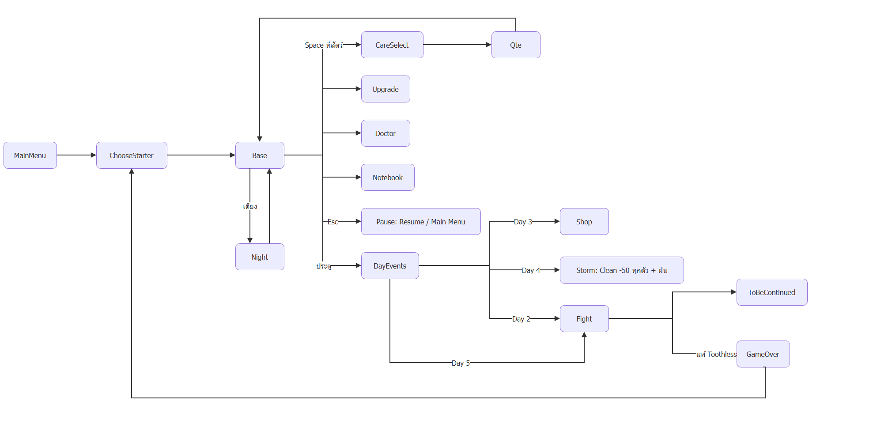

# Class Diagram — BePal Architecture (Prototype)

Project: `BEPAL/Bepal_Game/Bepal/` — MonoGame DesktopGL 3.8.4, .NET 8, 1280x720. ภาพส่วนใหญ่ยังเป็น placeholder ที่วาดจากรูปทรง; asset จริงมีเฉพาะ parallax 5 ชั้น, `fg_jungle`, `player.png` (สถานะเต็มดู [05-asset-list.md](05-asset-list.md))

## โครงสร้างโฟลเดอร์

| โฟลเดอร์ | หน้าที่ |
| --- | --- |
| `Core/` | `Gfx` (วาดรูปทรง/ข้อความ/สั่นจอ), `Input` (คีย์บอร์ด/เมาส์), `SceneManager` + `Scene` (stack ของหน้าจอ + fade), `Ui` (ปุ่ม, หลอด, สีกลาง `Palette`), `Ease` (`Ease.cs`: easing/damp + `Smoothed` สำหรับ movement polish), `Telemetry` + `RunSeed` (`Telemetry.cs`: log เหตุการณ์ต่อ run เป็น JSONL เมื่อใช้ `--telemetry <dir>`, ไม่ทำอะไรถ้าไม่เปิด; `RunSeed` ทำให้ Random ของเกม reproducible ด้วย `--seed`), `Audio` + `Sfx` (เล่น SFX จาก `Content/Sfx/*.wav`, เงียบเมื่อ `--autoplay`/`--shots` หรือไม่มี audio device) |
| `Model/` | `Pet`, `Enemy`, `GameState`, `Balance` (ตัวเลขทั้งหมดจาก [06-vertical-slice.md](06-vertical-slice.md)) |
| `World/` | `Backdrop` (parallax สไปรต์ 5 ชั้น: sky/clouds/hills/mid/near จาก `Content/Sprites/bg_parallax_*.png`, สเกล 4x, โหลดผ่าน `Backdrop.Load` ใน `Gfx.Init`), `Art` (ตัวละคร placeholder; ตั้ง `Art.PlayerSprite` = รูปเดียวเพื่อแทนที่ตัว primitive), `SpriteMotion` (`SpriteMotion.cs`: pose หายใจ/เด้ง/เอียง/ยืดหด/พลิกหันจากความเร็ว สำหรับรูปเดียวไม่มี frame animation), `Rain` (VFX ฝน Day 4: static, tick จาก `SceneManager.Update`, วาดผ่านหน้าต่างใน `BaseScene`, `Rain.Flash()` จาก `DayEvents.Storm`) |
| `Scenes/` | หน้าจอทั้งหมด (ด้านล่าง) |
| `DevTools/` | `ShotRunner` (`--shots <dir>` เซฟภาพทุกหน้าจอ), `AutoPlay` (`--autoplay [--refuse] [--bot <profile>] [--seed n] [--telemetry <dir>]` บอทเล่น Day 1–5 เพื่อหา soft-lock และเก็บ telemetry; ดู `BEPAL/Docs/Balance/telemetry-spec.md`) |

## Scenes

> Draw.io: [diagrams/scene-flow.drawio](diagrams/scene-flow.drawio) (เปิดด้วย VS Code Draw.io Integration)

| Class | Figma Scene |
| --- | --- |
| `MainMenuScene` | 1 |
| `ChooseStarterScene` + `PetPickScene` | 2, 17 |
| `BaseScene` (side-scroller, A/D + Space) | 3 |
| `CareSelectScene` | 4 |
| `QteScene` (`Care.Train/Feed/Clean/Heal`) | 5–8 |
| `NotebookScene` | 9–11 |
| `UpgradeScene` | 12 |
| `DoctorScene` | 13 |
| `DayEvents` + `DialogueScene` / `ChoiceScene` | 14–16, 20 |
| `FightScene` | 18 |
| `Wheel` (`Wheel.cs`: เข็มหมุน + `Zone`, ใช้ร่วมใน CareSelect / Qte / Fight; `Evaluate()` → `Hit.Miss/Great/Perfect`) | 4–8, 18 |
| `ChoiceScene` "Paused" (Esc ใน `BaseScene`: Resume / Main Menu) | เพิ่มใน slice |
| `ShopScene`, `NightScene`, `GameOverScene`, `ToBeContinuedScene` | เพิ่มใน slice |

## หลักการ

- **Scene stack:** หน้าต่างซ้อน (`Overlay = true`) วาดทับฉากด้านล่าง แต่มีแค่ scene บนสุดที่ `Update` — เปิดหน้าใหม่ด้วย `M.Push`, ปิดด้วย `M.Remove(this)` แล้วค่อยเรียก callback
- **ตัวเลขอยู่ที่ `Balance` ที่เดียว** — ปรับบาลานซ์ได้โดยไม่ต้องแก้ logic
- **Passive ของสัตว์:** `Pet.Passive` (ข้อความ) + `Pet.PassiveUnlocked` (Lv ≥ `Balance.PassiveLevel` = 2); ผลทำงานใน `FightScene` — Mossling heal 1% MaxHp/attack, Toothless พิษ (ศัตรูรับ +25% / ตี −25%, ไม่ stack), Blinkbun วาร์ปเข็มไป 12 นาฬิกา; Nibbleclaw combo (attack โดนติดกัน +50% ของดาเมจฐานต่อครั้ง รีเซ็ตเมื่อกดพลาด/เปลี่ยนตัว)
- **Lv3:** แสดงข้อความ "learned a new move!" (coming soon) — ยังไม่มีกลไกท่าใหม่
