# Asset List — BePal (Master Asset & Image Checklist v3.0)

รายการ Asset ทั้งหมดของ BePal — **ภาพ 2D สำหรับ ธัญญรัตน์ (เดียร์)**, **เสียง SFX & BGM สำหรับ ปีย์ตะวัน (ซุง) และ ภูมิพัฒน์ (ภูมิ)**, และ**ฟอนต์สำหรับ ภูมิพัฒน์ (ภูมิ)**

อ้างอิงขอบเขตจาก [06-vertical-slice.md](06-vertical-slice.md) (Day 1–5, side-scroller สไตล์ Kingdom: Classic), ชื่อสัตว์จาก [00-concept.md](00-concept.md) และ Art ต่อ scene จาก [01-core-loop.md](01-core-loop.md) (Scene 1–20 ใน Figma)

### Priority

| ป้าย | ความหมาย |
| --- | --- |
| **P0** | ต้องมีใน Prototype (ส่ง **พุธ 30 ก.ย. 2026**) — ถ้าไม่ทัน โค้ดยังใช้ placeholder (รูปทรง + ข้อความ) ได้ |
| **P1** | มีแล้วดีใน Prototype — อยู่ในฉากที่อาจโดนตัด (สมุด → Upgrade → ร้านค้า → หมอ ตาม 06 §6) |
| **Later** | เกมเต็ม / นอกขอบเขต Prototype (06 §5) |

> **สถานะปัจจุบัน:** ในโค้ดยังไม่มีไฟล์ภาพ/เสียงเลย — ตัวละครทั้งหมดวาดด้วยรูปทรงใน `World/Art.cs` และฉากหลัง parallax ใน `World/Backdrop.cs` · ฟอนต์ใช้ `Segoe UI` ชั่วคราว

### ข้อกำหนดทั่วไปสำหรับภาพ

- PNG พื้นหลังโปร่งใส (ยกเว้นฉากหลังเต็มจอ) · ความละเอียดเกม **1280×720**
- สไตล์ **Soft Hand-drawn + Uncanny Details** · โทนอุ่น (ครีม น้ำตาลอ่อน ส้มโคมไฟ) ในฐาน / ม่วง-น้ำเงินด้านนอก / แดงเตือนภัยที่ประตู (00-concept — Art & Visual Direction)
- ตัวละครทุกตัวใน side-view **หันขวา** (โค้ด flip ให้เองเมื่อเดินซ้าย) · จุดยึด (pivot) = **กลางเท้า**
- ข้อความในภาพเป็น **ภาษาอังกฤษ** ทั้งหมด (06 §4)
- สัตว์ตาย (HP = 0) โค้ด tint เป็นสีเทาให้เอง — ไม่ต้องวาดแยก · กรอบเรืองแสงตอน hover ทำด้วยโค้ดได้ (วาดแยกเป็น P1)

---

## 🎨 1. รายการภาพ 2D สำหรับ เดียร์ (2D Art Checklist)

### 1.1 ตัวผู้เล่น — The Lone Sanctuarist (NEW)

สิ่งมีชีวิตคล้ายมนุษย์ปริศนา ผู้ดูแลสถานพักพิง เดินซ้าย–ขวาในฐานด้วย `A` / `D`

| รหัส Asset | ชื่อไฟล์ | คำอธิบาย | ขนาด | Priority | สถานะ |
| --- | --- | --- | --- | --- | --- |
| **PLR-01** | `player/spr_player_idle.png` | ยืนนิ่ง หายใจเบาๆ (2–4 เฟรม sprite sheet แนวนอน) | 160×240 / เฟรม | P0 | 🔲 Not Started |
| **PLR-02** | `player/spr_player_walk.png` | เดิน (6–8 เฟรม sprite sheet แนวนอน) | 160×240 / เฟรม | P0 | 🔲 Not Started |
| **PLR-03** | `player/spr_player_interact.png` | ยื่นมือใช้ของ / ลูบหัวสัตว์ (ตอนกด `Space`) | 160×240 | P1 | 🔲 Not Started |
| **PLR-04** | `player/spr_player_sleep.png` | นอนบนเตียงตอน End day | 240×160 | P1 | 🔲 Not Started |

---

### 1.2 สัตว์เลี้ยง (Abnormal Pets — 280×360 px, PNG Transparent)

"น่ารักแต่แอบผิดปกติ (Uncanny)" — ดวงตาจ้องตามผู้เล่นตลอด (ถ้าวาดตาแยก layer ได้ โค้ดจะขยับตาให้)

| รหัส Asset | ชื่อไฟล์ | คำอธิบาย & รายละเอียดทางภาพ | ขนาด | Priority | สถานะ |
| --- | --- | --- | --- | --- | --- |
| **PET-01** | `pet/spr_mossling_idle.png` | **Mossling (ไอ่แดง) — Idle/Walk:** สิ่งมีชีวิตกึ่งพืช นุ่มฟูคล้ายตะไคร่น้ำ ตากลมโต มีดอกไม้ตูมบนหัว รักสงบ ตกใจง่าย | 280×360 | P0 | 🔲 Not Started |
| **PET-02** | `pet/spr_mossling_attack.png` | **Mossling — Attack:** พุ่งชน / ตะไคร่ฟูพองขึ้น (ใช้ใน Fight) | 280×360 | P0 | 🔲 Not Started |
| **PET-03** | `pet/spr_mossling_hurt.png` | **Mossling — Hurt:** ตัวลีบแบน กลีบดอกไม้ร่วง (โดนตี / Dodge พลาด) | 280×360 | P0 | 🔲 Not Started |
| **PET-04** | `pet/spr_mossling_happy.png` | **Mossling — Happy:** ดอกไม้บนหัวผลิบาน แก้มอมชมพู (หลัง QTE สำเร็จ) | 280×360 | P1 | 🔲 Not Started |
| **PET-05** | `pet/spr_nibbleclaw_idle.png` | **Nibbleclaw (ไอ่ซุง) — Idle/Walk:** คล้ายแมวผสมตัวกินมด จมูกยาว กรงเล็บแหลมยาวซ่อนใต้ขน คล่องแคล่ว | 280×360 | P0 | 🔲 Not Started |
| **PET-06** | `pet/spr_nibbleclaw_attack.png` | **Nibbleclaw — Attack:** กางกรงเล็บตะปบ | 280×360 | P0 | 🔲 Not Started |
| **PET-07** | `pet/spr_nibbleclaw_hurt.png` | **Nibbleclaw — Hurt:** ขดตัว หูลู่ | 280×360 | P0 | 🔲 Not Started |
| **PET-08** | `pet/spr_nibbleclaw_happy.png` | **Nibbleclaw — Happy:** ยืดตัว กระดิกหาง | 280×360 | P1 | 🔲 Not Started |
| **PET-09** | `pet/spr_blinkbun_idle.png` | **Blinkbun (ไอ่เขียว) — Idle/Walk:** กระต่ายหูยาว ขนม่วงเข้ม **ตาที่สามกลางหน้าผาก** ลึกลับ อดทนสูง | 280×360 | P0 | 🔲 Not Started |
| **PET-10** | `pet/spr_blinkbun_attack.png` | **Blinkbun — Attack:** ตาที่สามเบิกกว้าง ปล่อยหมอกดำรอบตัว | 280×360 | P0 | 🔲 Not Started |
| **PET-11** | `pet/spr_blinkbun_hurt.png` | **Blinkbun — Hurt:** หูพับ ตัวหด | 280×360 | P0 | 🔲 Not Started |
| **PET-12** | `pet/spr_blinkbun_happy.png` | **Blinkbun — Happy:** หูลู่ ตาปิดสนิท ยิ้มสงบ | 280×360 | P1 | 🔲 Not Started |
| **PET-13** | `pet/spr_toothless_idle.png` | **Toothless — Idle (ศัตรู Day 2):** สัตว์เลื้อยคลานดำทมิฬ ผิวลื่นไร้ฟัน ถุงกรดสีม่วงที่ลำคอ | 280×360 | P0 | 🔲 Not Started |
| **PET-14** | `pet/spr_toothless_attack.png` | **Toothless — Attack "Acid":** อ้าปากพ่นกรด ถุงกรดพองโต (ท่าศัตรูใน Fight) | 280×360 | P0 | 🔲 Not Started |
| **PET-15** | `pet/spr_toothless_hurt.png` | **Toothless — Hurt** | 280×360 | P0 | 🔲 Not Started |
| **PET-16** | `pet/spr_toothless_tamed.png` | **Toothless — Tamed:** หมอบลงอย่างว่าง่าย (หน้า "You got new pet !!!" และเดินในฐานหลัง Tame) | 280×360 | P0 | 🔲 Not Started |
| **PET-17** | `pet/spr_<pet>_outline.png` | สัตว์ทุกตัวพร้อมกรอบเรืองแสง (hover หน้าเลือกสัตว์ S2 / S17) — โค้ดทำ glow แทนได้ | 280×360 | P1 | 🔲 Not Started |
| **PET-18** | `pet/spr_<pet>_portrait.png` | รูปหน้าสัตว์สำหรับสมุด pet discovery (S10) และหน้าหมอ (S13) | 200×200 | P1 | 🔲 Not Started |

---

### 1.3 NPC & ศัตรู (NPC & Enemy Sprites — 320×400 px)

| รหัส Asset | ชื่อไฟล์ | คำอธิบาย & ท่าทาง | ขนาด | Priority | สถานะ |
| --- | --- | --- | --- | --- | --- |
| **NPC-01** | `npc/spr_doctor.png` | **หมอ:** ยืนประจำจุดหมอในฐาน (S3) และในหน้า Doctor (S13) | 320×400 | P1 | 🔲 Not Started |
| **NPC-02** | `npc/spr_merchant_idle.png` | **The Traveling Collector (Idle):** ชายร่างสูงชุดคลุมทมิฬ หมวกปีกกว้าง รอยยิ้มฟันทอง (Day 3) | 320×400 | P0 | 🔲 Not Started |
| **NPC-03** | `npc/spr_merchant_talk.png` | **The Traveling Collector (Talk):** ยื่นมือสวมถุงมือหนังตอนเสนอซื้อสัตว์ 5,000 coin | 320×400 | P1 | 🔲 Not Started |
| **NPC-04** | `npc/spr_bigz_idle.png` | **Big Z (บอส Day 5, HP 9999):** ศัตรูที่ใหญ่และน่ากลัวกว่า Toothless ชัดเจน — ⚠️ ยังไม่มี concept ใน GDD/Figma ต้องให้ภูมิกำหนด | 480×520 | P0 | 🔲 Not Started |
| **NPC-05** | `npc/spr_bigz_attack.png` | **Big Z — Attack:** ท่าโจมตีใน Fight | 480×520 | P0 | 🔲 Not Started |
| **NPC-06** | `npc/spr_merchant_angry.png` | Merchant (Angry) — ชักดาบซ่อนในไม้เท้า | 320×400 | Later | 🔲 Not Started |
| **NPC-07** | `npc/spr_merchant_flask.png`, `_gatling.png`, `_cane.png`, `_defeat.png` | Merchant Boss Fight 3 เฟส + ท่าแพ้ (Prototype ปฏิเสธพ่อค้า = เปิดร้าน ไม่มี Boss Fight) | 320×400 | Later | 🔲 Not Started |

---

### 1.4 ฐาน Side-Scrolling (Base World — NEW)

ฐานกว้างประมาณ **3 หน้าจอ (3840 px)** ประตูอยู่ขวาสุด (06 §2):

```
[ขอบมืด] — เตียง (End day) — Upgrade — [Core Hearth + สัตว์เดินไปมา] — หมอ — สมุด — [ประตูแดง]
```

**Parallax layers** (วาดแยก layer, PNG โปร่งใส ยกเว้นท้องฟ้า · ต้องต่อขอบซ้าย–ขวาได้ถ้าสั้นกว่า 3840):

| รหัส Asset | ชื่อไฟล์ | คำอธิบาย | ขนาด | Priority | สถานะ |
| --- | --- | --- | --- | --- | --- |
| **ENV-01** | `env/bg_sky_day.png` | ท้องฟ้ากลางวัน ไล่สีม่วง → ส้มอุ่น + ดาวเคราะห์ดวงใหญ่ | 1280×720 | P0 | 🔲 Not Started |
| **ENV-02** | `env/bg_sky_night.png` | ท้องฟ้ากลางคืน น้ำเงินเข้ม + ดาว (โค้ด fade จากกลางวันตอน End day) | 1280×720 | P0 | 🔲 Not Started |
| **ENV-03** | `env/bg_mountain_far.png` | ภูเขาไกล สีม่วงหม่น (เลื่อน 0.25×) | 2560×720 | P0 | 🔲 Not Started |
| **ENV-04** | `env/bg_mountain_near.png` | ภูเขาใกล้ สีม่วงเข้ม (เลื่อน 0.5×) | 3200×720 | P0 | 🔲 Not Started |
| **ENV-05** | `env/bg_base.png` | ตัวฐาน ผนัง/โครงสร้างภายใน แสงส้มอุ่นกลางฐาน มืดลงที่ขอบซ้าย | 3840×720 | P0 | 🔲 Not Started |
| **ENV-06** | `env/bg_ground.png` | พื้นดินดาวรกร้าง (layer หน้าสุด) | 3840×160 | P0 | 🔲 Not Started |

**วัตถุในฐาน** (ผู้เล่นเดินไปใกล้แล้วกด `Space`):

| รหัส Asset | ชื่อไฟล์ | คำอธิบาย | ขนาด | Priority | สถานะ |
| --- | --- | --- | --- | --- | --- |
| **ENV-07** | `env/spr_core_hearth.png` | **Core Hearth:** แกนกลางฐาน แสงไฟส้มอุ่น จุดศูนย์กลางของชีวิตในฐาน (2–4 เฟรมไฟกะพริบ) | 240×280 | P0 | 🔲 Not Started |
| **ENV-08** | `env/spr_bed.png` | **เตียง:** จุด End day (ซ้ายสุดของฐาน) | 240×140 | P0 | 🔲 Not Started |
| **ENV-09** | `env/spr_door_red.png` | **ประตูเหล็กแดง (The Red Door):** ขวาสุดของฐาน — สถานะปิด | 220×360 | P0 | 🔲 Not Started |
| **ENV-10** | `env/spr_door_red_knock.png` | ประตูแดงตอนมี Event (สั่น/มีแสงแดงรั่ว) — ใช้คู่กับไอคอน Knock | 220×360 | P1 | 🔲 Not Started |
| **ENV-11** | `env/spr_upgrade_station.png` | **สถานี Upgrade** | 200×240 | P1 | 🔲 Not Started |
| **ENV-12** | `env/spr_notebook_desk.png` | **โต๊ะสมุด** (เปิดสมุด S9) | 180×180 | P1 | 🔲 Not Started |
| **ENV-13** | `env/spr_doctor_station.png` | **มุมหมอ** (เตียงพยาบาล/ตู้ยา — หมอยืนข้างๆ) | 220×240 | P1 | 🔲 Not Started |
| **ENV-14** | `env/spr_merchant_cart.png` | **เกวียนพ่อค้า** จอดหน้าประตู (Day 3) | 400×300 | P1 | 🔲 Not Started |
| **ENV-15** | `env/spr_acid_puddle.png` | คราบกรดสีม่วงหน้าประตู (หลัง Toothless บุก) | 160×48 | Later | 🔲 Not Started |

---

### 1.5 ฉากหลังหน้าจออื่นๆ (Screen Backgrounds — 1280×720 px)

| รหัส Asset | ชื่อไฟล์ | คำอธิบาย & บรรยากาศ | Scene | Priority | สถานะ |
| --- | --- | --- | --- | --- | --- |
| **BG-01** | `bg/bg_menu.png` | Menu Background — ฐานยามค่ำคืน แสงไฟสลัว อบอุ่นแต่ลึกลับ | S1 | P0 | 🔲 Not Started |
| **BG-02** | `bg/bg_base_blur.png` | ฐานแบบ Blur (หน้าเลือกสัตว์) — โค้ดทำ blur/dark จาก ENV ได้ ถ้าไม่ทัน | S2, S17 | P1 | 🔲 Not Started |
| **BG-03** | `bg/bg_base_blur_dark.png` | ฐานแบบ Blur + dark tone (Care wheel / QTE) | S4–8 | P1 | 🔲 Not Started |
| **BG-04** | `bg/bg_fight.png` | ลานต่อสู้หน้าประตูแดง บรรยากาศตึงเครียด (ใช้ทั้ง Toothless และ Big Z) | S18 | P0 | 🔲 Not Started |
| **BG-05** | `bg/bg_thunderstorm.png` | หน้าข้อความพายุ (Day 4): ท้องฟ้ามืด ฟ้าผ่า ฝนหนัก | Day 4 | P0 | 🔲 Not Started |
| **BG-06** | `bg/bg_to_be_continued.png` | หน้า "To be continued..." หลังแพ้ Big Z (Day 5) | Day 5 | P0 | 🔲 Not Started |
| **BG-07** | `bg/bg_game_over.png` | หน้า Game Over (สัตว์ตายหมดในการสู้) | S18 | P1 | 🔲 Not Started |
| **BG-08** | `bg/bg_new_pet.png` | หน้า "You got new pet !!!" (แสงสปอตไลต์ + confetti) | S19 | P1 | 🔲 Not Started |
| **BG-09** | `bg/bg_merchant_shop.png` | ร้านค้าพ่อค้าเร่: แผงของลึกลับ ขวดแก้ว โซ่ กรงขัง | Day 3 | P1 | 🔲 Not Started |
| **BG-10** | `bg/bg_upgrade.png` | Upgrade background | S12 | P1 | 🔲 Not Started |
| **BG-11** | `bg/bg_doctor.png` | Doctor background | S13 | P1 | 🔲 Not Started |
| **BG-12** | `bg/bg_notebook.png` | Background สมุด (หน้ากระดาษเปิดคู่) | S9–11 | P1 | 🔲 Not Started |
| **BG-13** | `bg/bg_porch_morning.png` | ชานเรือนหน้าประตูยามเช้า | — | Later | 🔲 Not Started |
| **BG-14** | `bg/bg_daily_summary.png` | โต๊ะสรุปผลรายวันสไตล์ Papers, Please (Daily Summary ไม่อยู่ใน Prototype) | — | Later | 🔲 Not Started |

---

### 1.6 UI — Menu, Prompt & Dialogue

| รหัส Asset | ชื่อไฟล์ | คำอธิบาย | ขนาด | Scene | Priority | สถานะ |
| --- | --- | --- | --- | --- | --- | --- |
| **UI-01** | `ui/menu/logo_bepal.png` | โลโก้ชื่อเกม "BePal" | 640×220 | S1 | P0 | 🔲 Not Started |
| **UI-02** | `ui/menu/btn_play.png`, `btn_option.png`, `btn_quit.png` | ปุ่ม Play / Option / Quit (ปกติ + hover) — Option ยังไม่ทำงานใน Prototype | 240×64 | S1 | P1 | 🔲 Not Started |
| **UI-03** | `ui/keys/key_space.png`, `key_a.png`, `key_d.png`, `key_esc.png` | รูปปุ่มคีย์บอร์ด Space / A / D / ESC (หน้าเมนู + tutorial Day 1) | 64×64 (Space 160×64) | S1 | P1 | 🔲 Not Started |
| **UI-04** | `ui/prompt/prompt_space.png` | ป้าย `[Space]` ลอยเหนือของที่อยู่ใกล้ผู้เล่น | 96×40 | S3 | P0 | 🔲 Not Started |
| **UI-05** | `ui/dialogue/frame_textbox.png` | กรอบกล่องข้อความ (9-slice) โปร่งแสง ขอบไม้ | 1160×180 | S2, S15, S20 | P0 | 🔲 Not Started |
| **UI-06** | `ui/dialogue/btn_choice.png` | กรอบปุ่ม choice (ปกติ + hover) — ใช้กับ Chase/Tame, Sell/Refuse, Yes/No | 240×64 | S13, S16, S20 | P0 | 🔲 Not Started |
| **UI-07** | `ui/dialogue/btn_next_arrow.png` | ลูกศรกะพริบ คลิกเพื่อไปต่อ | 32×32 | S15 | P1 | 🔲 Not Started |
| **UI-08** | `ui/event/icon_knock.png` | ป้าย **"Knock Knock !!"** เหนือประตูแดง (Day 2+) | 200×80 | S14 | P0 | 🔲 Not Started |
| **UI-09** | `ui/event/panel_storm.png` | กรอบข้อความแจ้งพายุ + ไอคอนฟ้าผ่า | 720×240 | Day 4 | P1 | 🔲 Not Started |
| **UI-10** | `ui/common/btn_arrow_left.png`, `btn_arrow_right.png` | ลูกศรเลื่อนหน้า (สมุด / หมอเมื่อมีหลายตัว) | 48×48 | S10–13 | P1 | 🔲 Not Started |

---

### 1.7 HUD & Status

| รหัส Asset | ชื่อไฟล์ | คำอธิบาย | ขนาด | Priority | สถานะ |
| --- | --- | --- | --- | --- | --- |
| **HUD-01** | `ui/hud/icon_energy_pip.png` | ดวงแก้วพลังงาน AP (สว่าง = มี / มืด = ใช้แล้ว) — 3 ดวง, อัปเกรดได้ถึง 6 | 32×32 | P0 | 🔲 Not Started |
| **HUD-02** | `ui/hud/icon_coin.png` | เหรียญ coin | 32×32 | P0 | 🔲 Not Started |
| **HUD-03** | `ui/hud/panel_day.png` | กรอบแสดง "Day N" | 160×48 | P1 | 🔲 Not Started |
| **HUD-04** | `ui/hud/bar_exp.png` | แถบ Player LV + EXP (กรอบ + fill) | 240×24 | P0 | 🔲 Not Started |
| **HUD-05** | `ui/hud/bar_hp_fill.png` | แถบ HP (แดง) — ทั้งแบบใหญ่ (ศัตรูใน Fight) และเล็กบนหัวสัตว์ | 240×24 / 80×10 | P0 | 🔲 Not Started |
| **HUD-06** | `ui/hud/bar_stomach_fill.png` | แถบ Stomach (ส้ม) | 240×24 | P0 | 🔲 Not Started |
| **HUD-07** | `ui/hud/bar_clean_fill.png` | แถบ Clean (ฟ้า) | 240×24 | P0 | 🔲 Not Started |
| **HUD-08** | `ui/hud/bar_frame.png` | กรอบแถบ (ใช้ร่วมทุกแถบ, 9-slice) | 240×24 | P0 | 🔲 Not Started |
| **HUD-09** | `ui/hud/icon_points.png` | ไอคอน Skill Points (Upgrade) | 32×32 | P1 | 🔲 Not Started |

---

### 1.8 วงล้อ QTE — Care & Fight

สีตาม Figma (ยึดตาม 06 §4): **Train = แดง · Feed = เหลือง · Clean = ฟ้า · Heal = เขียว** — วงล้อกับเข็มโค้ดวาดเองได้ ให้ Art เน้นที่ป้ายและข้อความ feedback

| รหัส Asset | ชื่อไฟล์ | คำอธิบาย | ขนาด | Scene | Priority | สถานะ |
| --- | --- | --- | --- | --- | --- | --- |
| **QTE-01** | `ui/qte/wheel_ring.png` | วงแหวนวงล้อ (โปร่งกลาง) | 420×420 | S4–8, S18 | P1 | 🔲 Not Started |
| **QTE-02** | `ui/qte/wheel_needle.png` | เข็มวงล้อ + หมุดกลาง | 32×200 | S4–8, S18 | P1 | 🔲 Not Started |
| **QTE-03** | `ui/qte/label_train.png` | ป้าย **TRAIN** — แดง | 128×52 | S4 | P0 | 🔲 Not Started |
| **QTE-04** | `ui/qte/label_feed.png` | ป้าย **FEED** — เหลือง | 128×52 | S4 | P0 | 🔲 Not Started |
| **QTE-05** | `ui/qte/label_clean.png` | ป้าย **CLEAN** — ฟ้า | 128×52 | S4 | P0 | 🔲 Not Started |
| **QTE-06** | `ui/qte/label_heal.png` | ป้าย **HEAL** — เขียว | 128×52 | S4 | P0 | 🔲 Not Started |
| **QTE-07** | `ui/qte/dot_train.png`, `dot_feed.png`, `dot_clean.png`, `dot_heal.png` | จุดเป้าหมายในหน้า QTE (แดงเล็ก / เหลืองใหญ่กว่า / ฟ้า / เขียว) | 32×32 – 48×48 | S5–8 | P1 | 🔲 Not Started |
| **QTE-08** | `ui/qte/text_perfect.png`, `text_great.png`, `text_miss.png` | ข้อความ feedback หลังกด | 240×80 | S5–8, S18 | P0 | 🔲 Not Started |
| **QTE-09** | `ui/qte/label_dodge.png` | ป้าย **DODGE** (Perfect zone อย่างเดียว หดสั้นลง) | 156×52 | S18 | P0 | 🔲 Not Started |
| **QTE-10** | `ui/qte/label_attack.png` | ป้าย **ATTACK** (Perfect 100% / Great 75% ATK) | 156×52 | S18 | P0 | 🔲 Not Started |
| **QTE-11** | `ui/qte/btn_esc.png` | ป้าย ESC (กลับฐาน) | 96×40 | S4, S9–13 | P1 | 🔲 Not Started |

---

### 1.9 สมุด & Upgrade (S9–S12)

| รหัส Asset | ชื่อไฟล์ | คำอธิบาย | ขนาด | Scene | Priority | สถานะ |
| --- | --- | --- | --- | --- | --- | --- |
| **BK-01** | `ui/book/tab_pet_discovery.png`, `tab_disaster.png` | ปุ่มหัวข้อ Pet discovery / Disaster (ปกติ + hover) | 320×96 | S9 | P1 | 🔲 Not Started |
| **BK-02** | `ui/book/icon_element_<type>.png` | ไอคอนธาตุของสัตว์ (⚠️ ยังไม่มีรายชื่อธาตุใน GDD) | 48×48 | S10 | Later | 🔲 Not Started |
| **BK-03** | `ui/book/img_disaster_thunderstorm.png` | ภาพ Thunderstorm ในสมุด (ปลดล็อก Day 4) | 480×320 | S11 | P1 | 🔲 Not Started |
| **UPG-01** | `ui/upgrade/btn_plus.png` | ปุ่ม + (ปกติ / hover / disabled) | 48×48 | S12 | P1 | 🔲 Not Started |
| **UPG-02** | `ui/upgrade/icon_qte.png`, `icon_energy.png`, `icon_progress.png` | ไอคอน 3 สาย Upgrade: QTE / Energy / Progress Bar | 64×64 | S12 | P1 | 🔲 Not Started |

---

### 1.10 ไอเทม (Items — 48×48 px)

Prototype มีร้านค้า 3 ชิ้น (ซื้อแล้วใช้ทันที ไม่มีกระเป๋า — 06 §3.4)

| รหัส Asset | ชื่อไฟล์ | คำอธิบาย & การใช้งาน | ราคา | Priority | สถานะ |
| --- | --- | --- | --- | --- | --- |
| **ITM-01** | `ui/items/item_crab_apple.png` | **Crab Apple:** แอปเปิลทะเลสีแดงสด — สัตว์ 1 ตัว +18 HP, +20 Stomach | 25 | P1 | 🔲 Not Started |
| **ITM-02** | `ui/items/item_caffeine_tonic.png` | **Caffeine Tonic:** ยาชูกำลังสีอำพัน — Energy +2 วันนี้ | 40 | P1 | 🔲 Not Started |
| **ITM-03** | `ui/items/item_sea_tea.png` | **Sea Tea:** ชาน้ำทะเลสีฟ้าใส — Dodge zone +20% ใน Fight ครั้งถัดไป | 18 | P1 | 🔲 Not Started |
| **ITM-04** | `ui/items/item_cloudy_glasses.png` | Cloudy Glasses — โล่ป้องกัน 2 ครั้ง | — | Later | 🔲 Not Started |
| **ITM-05** | `ui/items/item_torn_notebook.png` | Torn Notebook — EXP Train +50% | — | Later | 🔲 Not Started |
| **EQP-01** | `ui/items/eqp_ballet_shoes.png` | Ballet Shoes — Perfect Zone +15% | — | Later | 🔲 Not Started |
| **EQP-02** | `ui/items/eqp_toy_knife.png` | Toy Knife — ATK สวนกลับ +35% | — | Later | 🔲 Not Started |
| **EQP-03** | `ui/items/eqp_faded_ribbon.png` | Faded Ribbon — Clean Decay −30% | — | Later | 🔲 Not Started |
| **ITM-06** | `ui/items/slot_frame.png` | กรอบช่องไอเทมในร้าน (+ ป้ายราคา) | 96×120 | P1 | 🔲 Not Started |

---

## 🔊 2. รายการเสียงสำหรับ ซุง & ภูมิ (Audio)

### 2.1 Sound Effects (SFX — WAV 44.1kHz 16-bit PCM)

| รหัส Audio | ชื่อไฟล์ | บริบทการเล่น | คำอธิบายอารมณ์เสียง | Priority |
| --- | --- | --- | --- | --- |
| **SFX-01** | `sfx/sfx_qte_perfect.wav` | กด Space โดน Perfect | ปิ๊งแก้วใสคมชัด น่าพึงพอใจ | P0 |
| **SFX-02** | `sfx/sfx_qte_great.wav` | กด Space โดน Great | เคาะไม้ทุ้มปานกลาง | P0 |
| **SFX-03** | `sfx/sfx_qte_miss.wav` | กดพลาด | Buzzer ทึบสั้นๆ | P0 |
| **SFX-04** | `sfx/sfx_wheel_select.wav` | เลือก choice บนวงล้อ Care สำเร็จ (จอสั่น) | ตุ้บหนักแน่น | P1 |
| **SFX-05** | `sfx/sfx_footstep.wav` | ผู้เล่นเดินในฐาน (สุ่ม pitch) | ก้าวเท้าเบาๆ บนพื้นดิน/ไม้ | P1 |
| **SFX-06** | `sfx/sfx_interact.wav` | กด `Space` ใช้ของในฐาน | ป๊อปเบาๆ | P1 |
| **SFX-07** | `sfx/sfx_ui_click.wav` | คลิกปุ่ม UI / ESC | คลิกนุ่ม | P0 |
| **SFX-08** | `sfx/sfx_knock.wav` | "Knock Knock !!" ที่ประตูแดง | เคาะประตูเหล็กสองครั้ง ก้องๆ | P0 |
| **SFX-09** | `sfx/sfx_door_open.wav` | เปิดประตูแดง | ประตูเหล็กหนักเลื่อนเปิด | P1 |
| **SFX-10** | `sfx/sfx_sleep.wav` | End day ที่เตียง (เข้ากลางคืน) | ระฆังลมเบาๆ / เสียงผ้าห่ม | P1 |
| **SFX-11** | `sfx/sfx_dodge_success.wav` | Dodge สำเร็จ | ลมวูบ (Whoosh) / Metallic Parry | P0 |
| **SFX-12** | `sfx/sfx_attack_hit.wav` | Attack โดนศัตรู | กระแทกหนักแน่น | P0 |
| **SFX-13** | `sfx/sfx_pet_hurt.wav` | สัตว์เราโดนโจมตี | ร้องเจ็บสั้นๆ แปลกๆ (uncanny) | P0 |
| **SFX-14** | `sfx/sfx_acid_spit.wav` | Toothless ใช้ท่า Acid | ของเหลวเดือดสาดกระเซ็น (Sizzle Splat) | P1 |
| **SFX-15** | `sfx/sfx_bigz_roar.wav` | Big Z ปรากฏ / โจมตี | คำรามต่ำ ทุ้มหนัก | P1 |
| **SFX-16** | `sfx/sfx_coin.wav` | ได้/จ่าย coin (รายได้เช้า, ร้าน, หมอ, ขายสัตว์) | เหรียญกระทบกัน | P0 |
| **SFX-17** | `sfx/sfx_level_up.wav` | Player LV up (+1 Point) | ไล่โน้ตขึ้นสดใส | P1 |
| **SFX-18** | `sfx/sfx_new_pet.wav` | "You got new pet !!!" | Jingle สั้นเฉลิมฉลอง | P1 |
| **SFX-19** | `sfx/sfx_thunder.wav` | หน้าข้อความพายุ Day 4 | ฟ้าผ่าเปรี้ยง + ฝน | P1 |
| **SFX-20** | `sfx/sfx_eat.wav`, `sfx_bubble.wav` | QTE Feed (เคี้ยวกรุบกรอบ) / QTE Clean (หยดน้ำ/สบู่) | ตาม 00-concept | Later |
| **SFX-21** | `sfx/sfx_typewriter_key.wav` | ตัวอักษรขึ้นใน dialogue | แป้นพิมพ์ดีดนุ่มๆ | Later |
| **SFX-22** | `sfx/sfx_coin_gatling.wav`, `sfx_cane_strike.wav` | Merchant Boss Fight | — | Later |

### 2.2 Background Music (BGM — OGG Looping)

| รหัส Audio | ชื่อไฟล์ | บริบทของฉาก | สไตล์และอารมณ์ดนตรี | Priority |
| --- | --- | --- | --- | --- |
| **BGM-01** | `music/bgm_menu.ogg` | Main Menu / เลือกสัตว์ | เงียบ ลึกลับ อบอุ่น | P1 |
| **BGM-02** | `music/bgm_base_cozy.ogg` | ฐาน (Day 1–5) + Care/QTE | อะคูสติกกีตาร์ + เปียโนไฟฟ้า Lo-Fi สบายๆ แต่มีโน้ตแปลกแทรก | P0 |
| **BGM-03** | `music/bgm_fight.ogg` | Fight กับ Toothless (Day 2) | ตึงเครียด จังหวะเร็ว | P0 |
| **BGM-04** | `music/bgm_merchant.ogg` | พ่อค้า + ร้านค้า (Day 3) | แจ๊ซหม่นๆ เจ้าเล่ห์ | P1 |
| **BGM-05** | `music/bgm_thunderstorm.ogg` | หน้าพายุ (Day 4) | ambient ฝนตก ฟ้าร้อง | P1 |
| **BGM-06** | `music/bgm_boss_bigz.ogg` | Fight กับ Big Z (Day 5) | หนักหน่วง สิ้นหวัง | P1 |
| **BGM-07** | `music/bgm_to_be_continued.ogg` | หน้า "To be continued..." | เปียโนเดี่ยว ค้างคา | P1 |
| **BGM-08** | `music/bgm_ending_bittersweet.ogg`, `bgm_ending_heroic.ogg` | ฉากจบ A/B ของ Merchant arc (เกมเต็ม) | — | Later |

> MonoGame เล่น `Song` จาก `.ogg` / `.mp3` ได้ แต่แนะนำ `.ogg` สำหรับ DesktopGL

---

## 🔤 3. ฟอนต์สำหรับ ภูมิ

ข้อความในเกมเป็นภาษาอังกฤษทั้งหมด — ไม่ต้องใช้ฟอนต์ไทย · ต้องเป็นฟอนต์ที่ **อนุญาตให้ใช้ในเกมได้** (เช่น Google Fonts / OFL)

| รหัส Font | ไฟล์ | บริบทการใช้งาน | สไตล์ฟอนต์ | ปัจจุบันในโค้ด | Priority |
| --- | --- | --- | --- | --- | --- |
| **FNT-01** | `Fonts/fnt_title_display.ttf` → `Big.spritefont` (44 pt) | โลโก้, หัวข้อหน้าจอ, "Knock Knock !!", "To be continued...", Perfect/Great/Miss | ตัวหนา กึ่งลึกลับ มีเอกลักษณ์ | `Segoe UI` 44 | P1 |
| **FNT-02** | `Fonts/fnt_ui_cozy.ttf` → `Main.spritefont` (18 pt) + `Small.spritefont` (14 pt) | Dialogue, ปุ่ม, HUD, คำอธิบายไอเทม | Sans-serif มน อบอุ่น อ่านง่าย | `Segoe UI` 18 / 14 | P1 |

---

## 🔄 4. Asset Pipeline

```mermaid
flowchart LR
    A[Staging<br>docs/02_Assets/_candidates/] --> B[Review โดย ภูมิ + เดียร์]
    B --> C[วางไฟล์ใน<br>BEPAL/Bepal_Game/Bepal/Content/]
    C --> D[เพิ่มใน Content.mgcb<br>MonoGame Content Builder]
    D --> E[Runtime<br>Content.Load&lt;T&gt;&#40;&#41;]
```



- โฟลเดอร์ใน `Content/` ใช้ตามชื่อไฟล์ในตาราง (`player/`, `pet/`, `npc/`, `env/`, `bg/`, `ui/...`, `sfx/`, `music/`, `Fonts/`)
- ส่งไฟล์ตามชื่อในตารางเป๊ะๆ — โค้ดจะเปลี่ยนจาก placeholder เป็นภาพจริงได้ทีละชิ้นโดยไม่ต้องรอครบชุด
- Sprite sheet แบบหลายเฟรม: เรียงแนวนอน ขนาดเฟรมเท่ากันทุกเฟรม แจ้งจำนวนเฟรมในชื่อไฟล์หรือแจ้งโชว์

---

## 📝 Changelog v3.0 (2026-09-28) — Sync กับ 06-vertical-slice

| เปลี่ยน | รายละเอียด |
| --- | --- |
| ชื่อสัตว์ | Coco → **Mossling**, Sproutlet → **Nibbleclaw**, Gloomtail → **Blinkbun** (ตาม 00-concept / 06) · ท่า Teleport/Angry ของ starter เปลี่ยนเป็น Attack/Hurt สำหรับ Fight |
| เพิ่มใหม่ | ตัวผู้เล่น (§1.1), ฐาน side-scroll + parallax + วัตถุในฐาน (§1.4), Big Z, หมอ, หน้า Thunderstorm / To be continued / Game Over / New pet, ป้าย `[Space]`, Knock icon, ไอคอน Upgrade, SFX/BGM ของ Day 1–5 |
| สี QTE | ใช้ตาม Figma: Train แดง / Feed เหลือง / Clean ฟ้า / Heal เขียว (แก้ปัญหาสีขัดกันใน v2.1) · ป้าย Fight เป็น DODGE / ATTACK (เดิม DODGE ZONE / COUNTER!) |
| ย้ายเป็น Later | Merchant Boss Fight 3 เฟส, ฉากจบ A/B, Daily Summary, Porch, ไอเทม 5 ชิ้น + อุปกรณ์, ไอคอนธาตุ, typewriter SFX |
| อื่นๆ | เพิ่มคอลัมน์ Priority, รวม §1.8 (Figma) เข้าหมวดหลัก, ฟอนต์ผูกกับ `.spritefont` ที่โค้ดใช้จริง, pipeline ชี้ไป `BEPAL/Bepal_Game/Bepal/Content/` |

**ยังรอข้อมูล:** concept ของ **Big Z** · รายชื่อธาตุสัตว์ (S10) · หน้า Option
