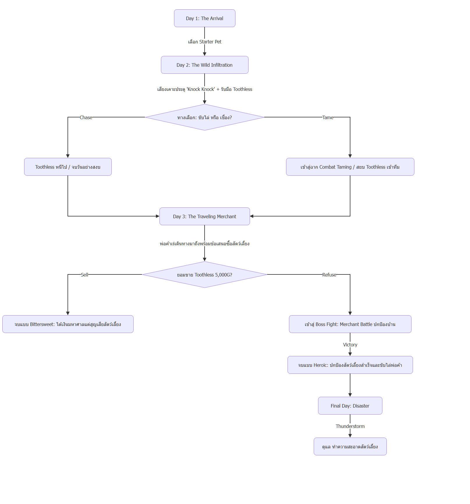

# BePal — Setting & Narrative

> **หมายเหตุ:** ปรับให้ตรงกับโค้ดแล้วเมื่อ 2026-10-07 — [06-vertical-slice.md](06-vertical-slice.md) และโค้ดยังเป็นข้อกำหนดหลักของ Prototype

ธีม โลก ฉาก ตัวเอก สัตว์เริ่มต้น กฎความสะอาด และเส้นเรื่อง — เนื้อหาย้ายแบบคงข้อความเดิมจากไฟล์ต้นทาง

ที่มา: แยกจาก [00-concept.md](00-concept.md) เมื่อ 2026-10-07 · ขอบเขต Prototype ตาม [06-vertical-slice.md](06-vertical-slice.md)

---

## Setting & Narrative

### Core Theme & Mood (จาก Figma)
- **Theme:** Cozy Sci-Fi meets Hardcore Survival (ความอบอุ่นที่แฝงความตึงเครียด)
- **Visual:** ห้องพักพิงที่ดูอบอุ่น โดดเดี่ยว แสงไฟสลัวๆ ตัดกับความลึกลับของอวกาศภายนอก
- **Feeling:** ความผูกพันจากการดูแลสัตว์ ขัดแย้งกับความกดดัน (High-Stakes) ที่ต้องตัดสินใจเด็ดขาดเมื่อทรัพยากรไม่พอ หรือเมื่อต้องเผชิญหน้ากับความตาย (Permadeath)
- **Key Colors:** ส้ม/เหลืองอุ่นๆ บรรยากาศครึ้มในฐานทัพ ตัดกับสีแดงเตือนภัยจากเหตุการณ์หน้าประตู

### World-Building (จาก Figma)
- **The Sanctuary:** ฐานพักพิงเล็กๆ กลางดาวเคราะห์รกร้าง มีแกนกลางที่มีแสงไฟอุ่นๆ เป็นเซฟโซนเดียวท่ามกลางความมืดของอวกาศ
- **The Red Door:** ประตูเหล็กสีแดง ทางออกเดียวสู่โลกภายนอก และต้นตอของเหตุการณ์สุ่มทุกอย่างในเกม (สัตว์หลงทาง, พายุอวกาศ, พ่อค้าจอมขูดรีด)
- **The Economy:** โลกที่ขับเคลื่อนด้วยเงินตรา (Coin/Gold) อย่างโหดร้าย ไม่มีใครช่วยใครฟรีๆ ทุกอย่างมีราคา แม้กระทั่งการชุบชีวิต
- **The Antagonists:** ความไร้ปรานีของระบบนิเวศอวกาศ พ่อค้าหน้าเลือดที่มองสัตว์เป็นแค่สินค้า และสัตว์ต่างๆ ที่มาเยือนดาว ทั้งดีและไม่ดี

### The Setting (สถานที่และบรรยากาศ)
**ฐานพักพิงกลางดาวรกร้าง (แรงบันดาลใจจากฐานใน Kingdom: Classic):** มองแบบ 2D Side-View ฐานมี **แกนกลาง (Core Hearth)** เล็กๆ ที่มีแสงไฟส้มอุ่นเป็นจุดศูนย์กลางของชีวิตในฐาน รอบนอกคือความมืดและภูมิประเทศรกร้างของดาว
- **ประตูแดงอยู่ที่ขอบฐาน:** เป็นเส้นแบ่งระหว่างฐานที่อบอุ่นกับโลกภายนอกที่ไม่แน่นอน ทุกสิ่งที่มาเคาะประตูมาจากความมืดด้านนอก

สิ่งอำนวยความสะดวกภายในฐาน (ตั้งเรียงตามแนวนอนจากแกนกลางออกไป):
- **มุมพักผ่อนและให้อาหาร:** เบาะนอน ชามข้าว และแท่นสังเกตการณ์สัตว์เลี้ยง
- **คอนโซลบริหารจัดการ (HUD Console):** แสดงสถานะค่าพลังงาน (Energy AP), วันที่ (Day), จำนวนเงิน (Gold), และเลเวลของผู้เล่น (Player Level & EXP Bar)
- **สถานีอัปเกรดฐาน (Upgrade Station):** พัฒนาทักษะ 3 สาย (QTE Zone, Max Energy, Progress Booster)
- **โต๊ะคลินิกและคุณหมอ (Doctor NPC):** ชุบชีวิตสัตว์เลี้ยงฉุกเฉิน (250G Revive) เมื่อ HP = 0
- **ชั้นวางอุปกรณ์และโต๊ะบันทึก (Survival Desk):** ค้นหาสมุดบันทึกสัตว์เลี้ยง (Pet Discovery) และบันทึกภัยพิบัติ (Disaster Log)
- **ประตูแดงคู่ (Front Door):** จุดเชื่อมต่อสู่โลกภายนอก ("Knock Knock !!") จุดเริ่มต้นของเหตุการณ์ประจำวัน

### Protagonist (ตัวละครเอก)
**The Lone Sanctuarist (ผู้ดูแลสถานพักพิง):** สิ่งมีชีวิตปริศนารูปร่างคล้ายมนุษย์ (Humanoid) ที่อุทิศตัวดูแลสัตว์หลงทาง ไม่มีใครรู้ที่มาที่ไป และมีพลังงานจำกัดในแต่ละวัน — ผู้ดูแลที่มีความมุ่งมั่นในการให้ที่พักพิงแก่สัตว์ประหลาดที่ไม่สามารถปรับตัวเข้ากับระบบนิเวศทั่วไปได้ ต้องรับมือทั้งปัญหาค่าใช้จ่าย ภัยพิบัติทางธรรมชาติ และการคุกคามจากภายนอก

### Starter Pets (สัตว์เลี้ยงเริ่มต้น 3 สายพันธุ์ / สัตว์ปริศนาประจำสถานพักพิง)

| สายพันธุ์ & ฉายา | บุคลิก & ลักษณะเด่น                                                        | สเตตัสเริ่มต้น            | แอ็กชันที่ชอบ    | สกิลติดตัว (Passive)                                                  |
| ---------------- | -------------------------------------------------------------------------- | ------------------------- | ---------------- | --------------------------------------------------------------------- |
| **Mossling**     | สิ่งมีชีวิตกึ่งพืช นุ่มฟูคล้ายตะไคร่น้ำ ดวงตากลมโต รักสงบ ตกใจง่าย         | HP: 100 / St: 80 / Cl: 70 | **Feed, Clean**  | Passive (ปลดล็อก Pet Lv ≥ 2): ฟื้น HP 1% ของ Max HP ทุกครั้งที่ Attack |
| **Nibbleclaw**   | สิ่งมีชีวิตคล้ายแมวผสมตัวกินมด มีกรงเล็บแหลมยาวซ่อนใต้ขน คล่องแคล่ว ว่องไว | HP: 90 / St: 70 / Cl: 80  | **Train, Clean** | Passive (Lv ≥ 2): Combo — Attack โดนติดกันดาเมจเพิ่มขึ้นทีละ 50% ของฐาน รีเซ็ตเมื่อพลาด |
| **Blinkbun**     | กระต่ายหูยาวขนสีม่วงเข้ม มีดวงตาที่สามตรงหน้าผาก ลึกลับ อดทนสูง            | HP: 110 / St: 60 / Cl: 60 | **Heal, Feed**   | Passive (Lv ≥ 2): หลัง Attack เข็มวาร์ปไป 12 นาฬิกา (first pass)       |

### กฎความสะอาดและสภาพความพร้อมสู้ (Combat Readiness Rule)
- **Clean ≤ 50 (สกปรก):** การโจมตีของสัตว์เลี้ยงจะเบาลง (Figma Scene 7)
- **Clean ≤ 25 (สกปรกมาก):** ลด Max HP ของสัตว์เลี้ยงตัวนั้นด้วย (Figma Scene 7)
- **Stomach = 0 (หิวโซ):** สัตว์เลี้ยงเสีย HP 20 ทุกครั้งที่ End day (Figma Scene 6)

> ~~Clean < 50 ปฏิเสธที่จะออกไปต่อสู้ (Refuse to Fight)~~ — ยกเลิกแล้ว ใช้กฎลดพลังโจมตี/Max HP ตาม Figma แทน

### Narrative Arc & Mystery (แก่นเรื่องและไทม์ไลน์ Vertical Slice: Day 1 - 3+)

> **หมายเหตุจาก Figma (07 · Game Flow (Event)):** Event เกิดหลังผู้เล่นกด **End day** แล้วขึ้นวันใหม่ ประตูจะขึ้น "Knock Knock !!" (กดประตูได้ตั้งแต่ **Day 2** เป็นต้นไป — Day 1 เป็นวันให้ผู้เล่นทำความรู้จักระบบ) และ Event จะ **สุ่มเกิด 3 แบบ**: เจอสัตว์ตัวใหม่ · เจอพ่อค้า · เจอภัยธรรมชาติ
> ไทม์ไลน์ด้านล่าง (Day 2 = Toothless, Day 3 = Merchant) คือลำดับที่ใช้ใน **Vertical Slice / Prototype** ตามภาพ mockup ใน Figma ส่วนเกมเต็มใช้ระบบสุ่ม

> Draw.io: [diagrams/narrative-days.drawio](diagrams/narrative-days.drawio) (เปิดด้วย VS Code Draw.io Integration)

1. **Day 1 — The Arrival (การเริ่มต้น):**
   - ผู้เล่นเปิดร้าน เลือก Starter Pet ตัวแรก (Coco, Sproutlet, หรือ Gloomtail)
   - เรียนรู้ระบบพื้นฐาน: การจัดสรรพลังงาน 6 แต้ม, การให้อาหาร (Feed), ทำความสะอาด (Clean), และฝึกฝน (Train)

2. **Day 2 — The Wild Infiltration & Taming (ผู้มาเยือนปริศนา):**
   - มีเสียงเคาะประตูปริศนาดังขึ้น (**"Knock Knock !!"**)
   - พบสัตว์ประหลาดร่างดำดุร้ายที่มีกรดกัดกร่อน (**Toothless**) บุกเข้ามา
   - **ทางเลือกสำคัญ:** 
     - *Chase:* ขับไล่ไปอย่างปลอดภัย (ไม่เสี่ยงเจ็บตัว แต่ไม่ได้สัตว์เพิ่ม)
     - *Tame:* เข้าสู่ระบบการต่อสู้และฝึกให้เชื่อง (Taming Encounter) ต้องหลบกรดพิษ (Acid Dodge) และสวนกลับจนได้เป็นสัตว์เลี้ยงตัวที่สอง (หากสัตว์ที่ส่งไปสู้ HP หมด จะกลับไปเลือกสัตว์ตัวอื่นมาสู้ต่อ โดยความคืบหน้าการต่อสู้ยังคงอยู่ ถ้าสัตว์ตายหมดทุกตัว = Game Over / สัตว์ที่ HP = 0 ชุบชีวิตได้ที่ Doctor 250)
     - *Chase:* กลับหน้าฐานทันที ไม่ต้องสู้ และ **ไม่เสีย Energy**

3. **Day 3 — The Traveling Merchant & The Moral Crossroads (พ่อค้าเร่และทางแยกแห่งจิตใจ):**
   - พ่อค้าเร่ปริศนาแวะมาเยือน เปิดร้านขายไอเทมพิเศษ (**Crab Apple, Sea Tea, Cloudy Glasses, Torn Notebook, Ballet Shoes, Toy Knife, Faded Ribbon**)
   - พ่อค้าสังเกตเห็น Toothless และยื่นข้อเสนอซื้อตัวด้วยเงินสดมหาศาล (**5,000 Gold**)
   - **ทางแยกแห่งผลลัพธ์:**
     - *ยอมรับข้อเสนอ (Sell):* ได้รับเงิน 5,000G ปลดหนี้และจบวันด้วยความร่ำรวย แต่สูญเสีย Toothless ตลอดกาล (Ending A)
     - *ปฏิเสธข้อเสนอ (Refuse):* พ่อค้าโกรธเกรี้ยว นำไปสู่การต่อสู้ระดับบอส (**Merchant Boss Fight**) ผู้เล่นและสัตว์เลี้ยงต้องร่วมมือกันต่อสู้จนคว้าชัยชนะ (Ending B)

1. **Final Day — The Disaster (ภัยธรรมชาติ):**
   - มีเสียงเคาะประตูดังขึ้น (**"Knock Knock !!"**)
   - มีข้อความขึ้นบอกผู้เล่นว่าวันนี้มีพายุหนักโหมกระหน่ำรอบฐาน (**Thunderstorm**) ทำให้สัตว์ของเราสกปรกทุกตัว ค่า Clean ลดฮวบ และต้องบริหารพลังงานฉุกเฉินเพื่อปลอบประโลม
