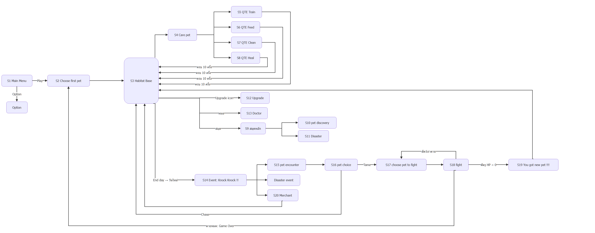

# BePal — Scene Breakdown

> **หมายเหตุ:** ปรับให้ตรงกับโค้ดแล้วเมื่อ 2026-10-07 — [06-vertical-slice.md](06-vertical-slice.md) และโค้ดยังเป็นข้อกำหนดหลักของ Prototype

ฉากทั้งหมดอ้างอิง Figma (Scene 1–20) และฉากเพิ่มเติมจาก GDD v2.0 — เนื้อหาย้ายแบบคงข้อความเดิมจากไฟล์ต้นทาง

ที่มา: แยกจาก [01-core-loop.md](01-core-loop.md) เมื่อ 2026-10-07 · ขอบเขต Prototype ตาม [06-vertical-slice.md](06-vertical-slice.md)

---

## Scene Breakdown (อ้างอิง Figma — 06 · Game Flow Scenes 1–13 และ 07 · Game Flow (Event) Scenes 14–20)

> Draw.io: [diagrams/scene-breakdown.drawio](diagrams/scene-breakdown.drawio) (เปิดด้วย VS Code Draw.io Integration)

| Scene | หน้าจอ | UI บนหน้าจอ | Programmer | Art |
| --- | --- | --- | --- | --- |
| **1** | Main Menu | BePal, Play, Option, Quit, "Space to Enter" | Play → เลือกสัตว์, Option → setting, ทำ transition เมื่อเปลี่ยน scene | รูป Spacebar + "Space to Enter", รูป WASD, รูปลูกศร, ชื่อเกม "BePal", ปุ่ม Play/Option/Quit, Menu Background |
| — | Option | — | *(ยังไม่มีรายละเอียดในบอร์ด)* | — |
| **2** | Choose first pet | "Choose your pet", ไอ่แดง / ไอ่เขียว / ไอ่ซุง | คลิ๊กเลือกสัตว์, hover ขึ้นกรอบรอบตัวสัตว์, เลือกแล้วเข้า Base | รูปสัตว์, รูปสัตว์กรอบเรืองแสง (hover), dialogue box, Base Background (Blur) |
| **3** | Habitat Base | Day, Coin, ชื่อสัตว์, Player LV + EXP, Upgrade icon, สมุด, End day (E) | คลิ๊กประตู = รับ Event (Day 2+), คลิ๊กสมุด/อัปเกรด/สัตว์/หมอได้, ทำ progress bar, ทุกวันใหม่ Stomach & Clean ลด, End day กดได้ทุกเมื่อ | UI สมุด, UI upgrade, รูปหมอ, รูปประตู, UI energy, progress bar overlay, UI Coin, Text Day, Base Background |
| **4** | Care pet | วงล้อ Train / Feed / Clean / Heal, ESC | วงล้อ QTE 4 choice สี, Spacebar โดน choice ไหนไป scene นั้น (ไม่โดน = ไม่เกิดอะไร), ESC กลับ Base, จอสั่นเมื่อกดโดน | Text แต่ละ choice, UI ESC, Base Background (Blur + dark tone) |
| **5** | QTE Train | EXP, LV, Attempt : 10, Progress Bar | จุดสีแดงเล็ก หลายจุด สุ่มตำแหน่ง (รวม 10 จุด เกิดใหม่จน Attempt = 0), เข็มหมุนเร็วกว่าปกติ, progress bar แยกสี — ดู [08-care-qte §3.2](08-care-qte.md) | progress bar, UI energy ลด, ข้อความ feedback Miss / Perfect / Great, Background (Blur + dark tone) |
| **6** | QTE Feed | Stomach, Attempt : 10 | จุดสีเหลือง (ใหญ่กว่าแดง), กดโดน = เปลี่ยนทิศการหมุน + จุดเกิดใหม่ | *(ไม่ระบุ)* |
| **7** | QTE Clean | Clean, Attempt : 10 | จุดสีฟ้า ขยับหนีไปทิศเดียวกับเข็มแต่ช้ากว่า | *(ไม่ระบุ)* |
| **8** | QTE Heal | Heal, Attempt : 10 | จุดสีเขียว, เข็มกะพริบเฟดหาย/กลับมา, choice ค่อยๆ หดสั้น | *(ไม่ระบุ)* |
| **9** | สมุดหลัก | pet discovery, Disaster, ESC | เลือกหัวข้อ, hover มีกรอบ, ESC กลับ Base, ดูได้เฉพาะสัตว์ที่มี / Disaster ที่เคยผ่าน | background สมุด, pet discovery UI, Disaster UI |
| **10** | สมุด pet discovery | Day, Coin, LV, Stomach, Clean, Health, ไอคอนธาตุ, คำอธิบายสัตว์, ESC | กดลูกศรไปหน้าถัดไป, ESC กลับ Base | *(ไม่ระบุ)* |
| **11** | สมุด Disaster | Day, Coin, ชื่อภัย (เช่น Thunder storm), คำอธิบาย, ESC | กดลูกศรไปหน้าถัดไป, ESC กลับ Base | รูป disaster |
| **12** | Upgrade | Points, Coin, QTE / Energy / Progress Bar + REQ | ดู [03-mechanics §1.3](03-mechanics.md) | Upgrade background, ปุ่ม +, Text QTE/Energy/Progress Bar, (อยากให้มี) icon points |
| **13** | Doctor | Day, Coin, Player LV, "Choose pet", ราคา 250 | ไม่มีสัตว์ HP = 0 → แสดงแค่ "choose pet", มี → แสดงรูป + ราคาชุบชีวิต, หลายตัวใช้ลูกศรเลื่อน, คลิ๊ก → "Are you sure?" Yes = กลับ Base พร้อม HP = 1 / No = กลับหน้าเลือก, ESC กลับ Base | Doctor Background |
| **14** | Event (Knock Knock !!) | "Knock Knock !!", Day, Coin, Player LV, End day | Event เกิดหลังกด End day แล้วขึ้นวันใหม่, สุ่ม 3 แบบ | icon knock |
| **15** | pet encounter | ชื่อสัตว์ (เช่น Toothless) + บทพูด | เกิดเมื่อกดประตูแล้วเจอสัตว์ตัวใหม่, คลิ๊กเพื่อข้ามข้อความ | *(ไม่ระบุ)* |
| **16** | pet choice | Chase, Tame | Chase = กลับฐานไม่ต้องสู้ไม่เสีย Energy, Tame = เข้าสู่การต่อสู้ | *(ไม่ระบุ)* |
| **17** | choose pet to fight | "Choose your pet" | คลิ๊กสัตว์เพื่อเข้าสู่การต่อสู้, hover ขึ้นกรอบ | *(ไม่ระบุ)* |
| **18** | fight | Health, Dodge, Attack, ชื่อท่า (เช่น Acid) | ดู Combat Loop ด้านบน / [09-combat-encounters §4.2](09-combat-encounters.md) | *(ไม่ระบุ)* |
| **19** | รับ new pet | "You got new pet !!!" | *(ยังเป็นข้อความทดสอบในบอร์ด)* | *(ไม่ระบุ)* |
| **20** | Merchant | Day, Coin, Merchant: "I'm quite interested your toothless… can you give it to me?" | *(ยังไม่ได้เขียนรายละเอียดในบอร์ด)* | *(ยังไม่ได้เขียนรายละเอียดในบอร์ด)* |

> **ส่วนที่ยังไม่ได้ออกแบบใน Figma:** หน้า Option, หน้า Disaster event (กิ่งที่ 3 ของ Event — บอร์ดยังใช้ข้อความชุดเดียวกับหน้า Upgrade), รายละเอียด Scene 19–20 และ Daily Summary / Emergency Revive modal (ยังคงตาม GDD v2.0 ด้านล่าง)

### ฉากเพิ่มเติมจาก GDD v2.0 (ยังไม่มีใน Figma)

1. **Prologue:** บทสนทนานำเข้าสู่เรื่องราวก่อนเลือกสัตว์เลี้ยง
2. **Morning Briefing:** การแจ้งเตือนเหตุการณ์ประจำวัน
3. **Daily Summary Report Card & Night Rest Screen:** หน้าต่างสรุปผลรายวันสไตล์ _Papers, Please_ แสดงผลเกรดการดูแล (S, A, B, C, F) สรุปการหักสเตตัส (Daily Decay) โบนัสเงินรางวัล และบันทึกการเล่นก่อนเข้าสู่วันถัดไป
