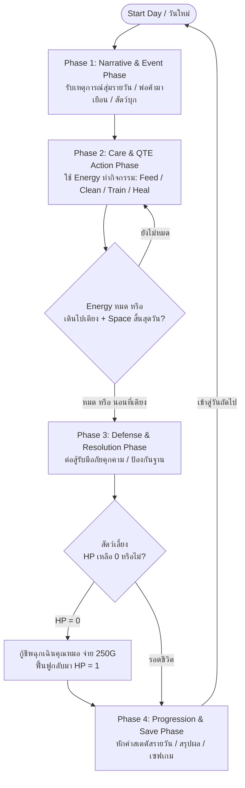
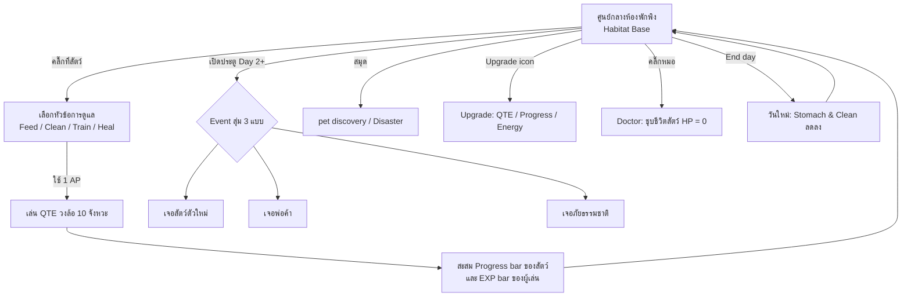
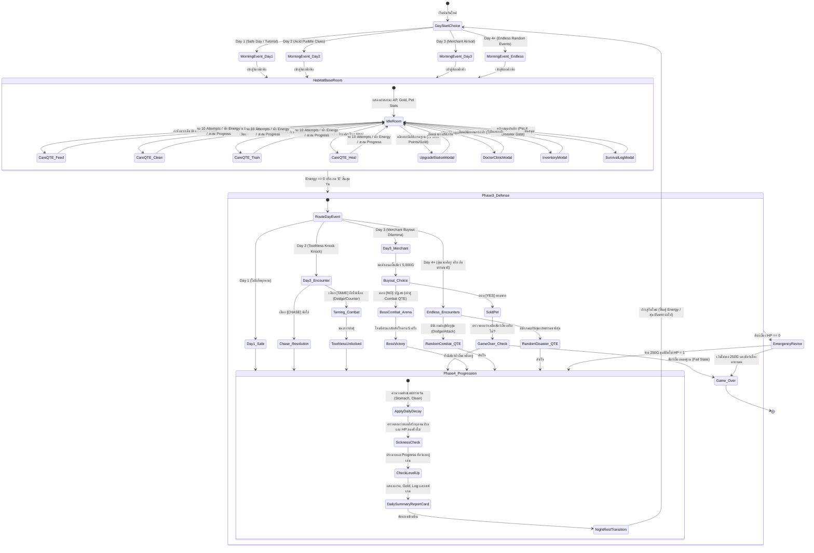
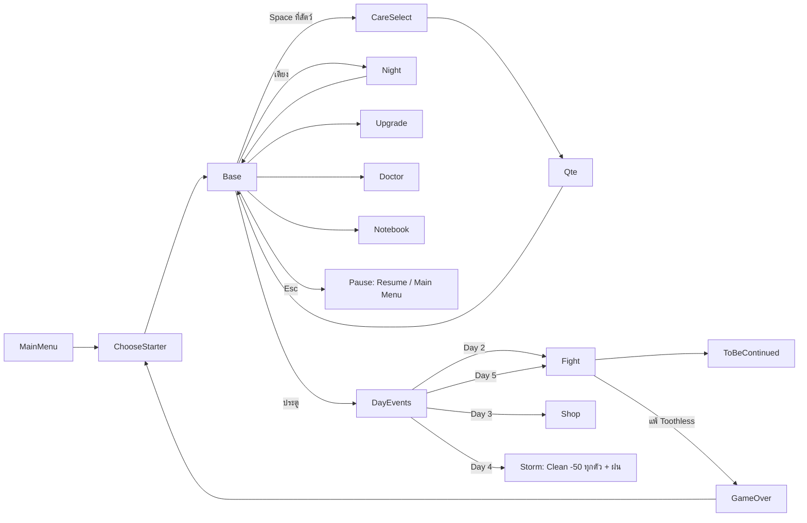
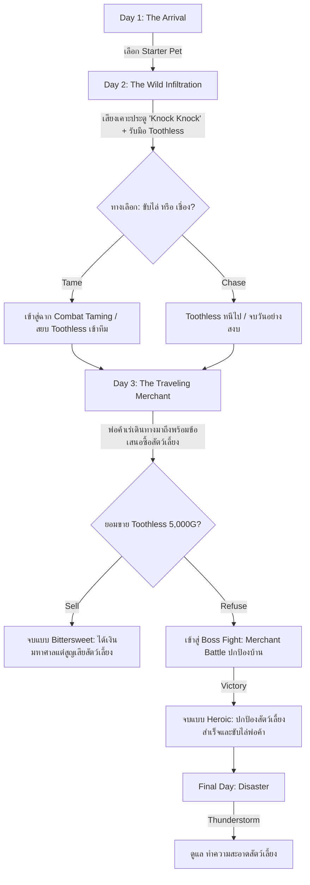
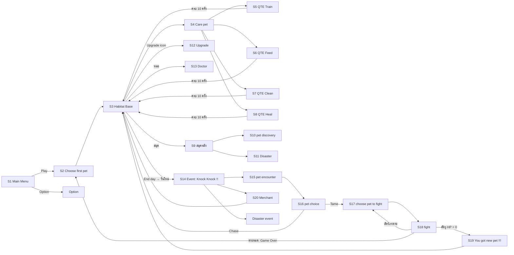

# Mermaid ต้นฉบับ (ก่อนแปลงเป็น Draw.io)

เก็บไว้เป็น Reference/สำรอง — ไดอะแกรมที่ใช้งานจริงคือไฟล์ .drawio ในโฟลเดอร์นี้ (ดึงจาก `git HEAD` ก่อนลบออกจาก GDD เมื่อ 2026-10-07)

## core-loop-day

มาจาก `01-core-loop.md` → [core-loop-day.drawio](core-loop-day.drawio)

## core-loop-base

มาจาก `01-core-loop.md` → [core-loop-base.drawio](core-loop-base.drawio)

## state-machine

มาจาก `03-mechanics.md` → [state-machine.drawio](state-machine.drawio)

## scene-flow

มาจาก `04-class-diagram.md` → [scene-flow.drawio](scene-flow.drawio)

## narrative-days

มาจาก `11-narrative-world.md` → [narrative-days.drawio](narrative-days.drawio)

## scene-breakdown

มาจาก `13-scene-breakdown.md` → [scene-breakdown.drawio](scene-breakdown.drawio)

